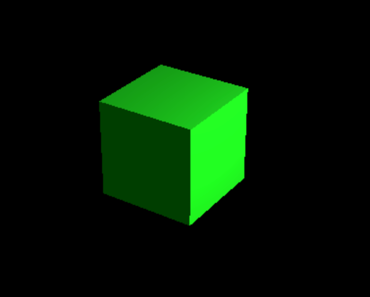

这章节，我们将介绍 Three.js 中常见的几何体（Geometry），包括立方体、球体、圆柱体、平面、圆环、圆锥体等。几何体是构建 3D 模型的基础元素，通过不同的几何体可以创建出各种形状的物体。

在 Three.js 中，几何体是由顶点、面、法线等数据组成的，通过材质（Material）的渲染，可以将几何体显示在屏幕上。不同的几何体有不同的属性和用途，可以根据需求选择合适的几何体来构建 3D 场景。

## 1. **BoxGeometry（立方体几何体）**

**函数**：

```javascript
THREE.BoxGeometry(
  width,
  height,
  depth,
  widthSegments,
  heightSegments,
  depthSegments
);
```

**参数**：

- `width`：立方体的宽度（默认为 1）。
- `height`：立方体的高度（默认为 1）。
- `depth`：立方体的深度（默认为 1）。
- `widthSegments`：水平分段数（默认为 1）。
- `heightSegments`：垂直分段数（默认为 1）。
- `depthSegments`：深度分段数（默认为 1）。

```javascript
const geometry = new THREE.BoxGeometry(5, 5, 5); // 创建一个宽为5、高为5、深为5的立方体
const material = new THREE.MeshStandardMaterial({ color: 0x00ff00 }); // 创建支持灯光的绿色材质
const cube = new THREE.Mesh(geometry, material); // 将几何体和材质组合成网格物体
scene.add(cube); // 将立方体添加到场景中
```



## 2. **SphereGeometry（球体几何体）**

- **函数**：

```javascript
THREE.SphereGeometry(
  radius,
  widthSegments,
  heightSegments,
  phiStart,
  phiLength,
  thetaStart,
  thetaLength
);
```

- **参数**：
  - `radius`：球体的半径（默认值为 1）。
  - `widthSegments`：球体的经度分段数，越大越平滑（默认值为 8）。
  - `heightSegments`：球体的纬度分段数，越大越平滑（默认值为 6）。
  - `phiStart`：开始的经度角度（默认为 0）。
  - `phiLength`：经度的弧长（默认为 Math.PI \* 2）。
  - `thetaStart`：开始的纬度角度（默认为 0）。
  - `thetaLength`：纬度的弧长（默认为 Math.PI）。

```javascript
const geometry = new THREE.SphereGeometry(5, 32, 32); // 创建半径为5的球体，32段纬度和经度
const material = new THREE.MeshStandardMaterial({ color: 0x0000ff }); // 创建蓝色材质
const sphere = new THREE.Mesh(geometry, material); // 创建球体物体
scene.add(sphere); // 将球体添加到场景中
```


## 3. **CylinderGeometry（圆柱体几何体）**

**函数**：

```javascript
THREE.CylinderGeometry(
  radiusTop,
  radiusBottom,
  height,
  radialSegments,
  heightSegments,
  openEnded,
  thetaStart,
  thetaLength
);
```

**参数**：

- `radiusTop`：圆柱顶部的半径（默认值为 1）。
- `radiusBottom`：圆柱底部的半径（默认值为 1）。
- `height`：圆柱的高度（默认值为 1）。
- `radialSegments`：圆柱的圆周分段数（默认值为 8）。
- `heightSegments`：圆柱的垂直分段数（默认值为 1）。
- `openEnded`：是否是开口的圆柱（默认为 `false`）。
- `thetaStart`：开始的角度（默认为 0）。
- `thetaLength`：角度的弧长（默认为 Math.PI \* 2）。

```javascript
const geometry = new THREE.CylinderGeometry(3, 3, 10, 32); // 创建半径为3，高度为10的圆柱体
const material = new THREE.MeshStandardMaterial({ color: 0xff0000 }); // 创建红色材质
const cylinder = new THREE.Mesh(geometry, material); // 创建圆柱体物体
scene.add(cylinder); // 将圆柱体添加到场景中
```


## 4. **PlaneGeometry（平面几何体）**

**函数**：

```javascript
THREE.PlaneGeometry(width, height, widthSegments, heightSegments);
```

**参数**：

- `width`：平面的宽度（默认值为 1）。
- `height`：平面的高度（默认值为 1）。
- `widthSegments`：平面的水平分段数（默认值为 1）。
- `heightSegments`：平面的垂直分段数（默认值为 1）。
- `side`：平面材质的显示面，`THREE.FrontSide`（正面），`THREE.BackSide`（背面），`THREE.DoubleSide`（两面）。

```javascript
const geometry = new THREE.PlaneGeometry(10, 10); // 创建宽为10，高为10的平面
const material = new THREE.MeshStandardMaterial({
  color: 0x00ffff,
  side: THREE.DoubleSide,
}); // 创建青色材质，双面渲染
const plane = new THREE.Mesh(geometry, material); // 创建平面物体
scene.add(plane); // 将平面添加到场景中
```


## 5. **TorusGeometry（圆环几何体）**

**函数**：

```javascript
THREE.TorusGeometry(radius, tube, radialSegments, tubularSegments, arc);
```

**参数**：

- `radius`：圆环的主半径（默认值为 1）。
- `tube`：圆环的管道半径（默认值为 0.4）。
- `radialSegments`：圆环的径向分段数（默认值为 8）。
- `tubularSegments`：管道的圆周分段数（默认值为 6）。
- `arc`：圆环的弧度范围（默认为 Math.PI \* 2）。

```javascript
const geometry = new THREE.TorusGeometry(5, 1, 16, 100); // 创建半径为5，管道半径为1的圆环
const material = new THREE.MeshStandardMaterial({ color: 0xffff00 }); // 创建黄色材质
const torus = new THREE.Mesh(geometry, material); // 创建圆环体
scene.add(torus); // 将圆环体添加到场景中
```


## 6. **ConeGeometry（圆锥体几何体）**

**函数**：

```javascript
THREE.ConeGeometry(
  radius,
  height,
  radialSegments,
  heightSegments,
  openEnded,
  thetaStart,
  thetaLength
);
```

**参数**：

    - `radius`：圆锥底部的半径（默认值为 1）。
    - `height`：圆锥的高度（默认值为 1）。
    - `radialSegments`：圆锥底部的分段数（默认值为 8）。
    - `openEnded`：是否是开口的圆锥（默认为 `false`）。
    - `thetaStart`：圆锥开始的角度（默认为 0）。
    - `thetaLength`：圆锥的角度弧长（默认为 Math.PI * 2）。

```javascript
const geometry = new THREE.ConeGeometry(5, 10, 32); // 创建半径为5，高度为10的圆锥
const material = new THREE.MeshStandardMaterial({ color: 0xff00ff }); // 创建紫色材质
const cone = new THREE.Mesh(geometry, material); // 创建圆锥物体
scene.add(cone); // 将圆锥添加到场景中
```


## 7. **Custom Geometry（自定义几何体）**

**函数**：

```javascript
THREE.BufferGeometry();
```

**参数**：`THREE.BufferGeometry` 是一个高级构造器，允许你手动指定顶点数据和其他几何信息。常见的自定义属性包括：

    - `position`：顶点的位置数据。
    - `normal`：法线数据。
    - `uv`：纹理坐标数据。

```javascript
const geometry = new THREE.BufferGeometry();
const vertices = new Float32Array([
  0,
  0,
  0, // 顶点1
  1,
  0,
  0, // 顶点2
  0,
  1,
  0, // 顶点3
]);
geometry.setAttribute("position", new THREE.BufferAttribute(vertices, 3)); // 设置顶点数据
const material = new THREE.MeshStandardMaterial({ color: 0x00ff00 }); // 创建材质
const mesh = new THREE.Mesh(geometry, material); // 创建网格物体
scene.add(mesh); // 添加到场景
```


## 8. **总结**

- 在 Three.js 中，几何体是构建 3D 模型的基础元素。通过组合不同的几何体，可以构建出更复杂的物体。对不同几何体的熟悉和应用，可以帮助我们快速构建 3D 场景。
- 除了标准几何体外，`BufferGeometry` 提供了更强的定制能力，可以满足更复杂的需求。
- 通过调整不同几何体的细节（如分段数、参数等），可以在性能和渲染效果之间找到平衡。
