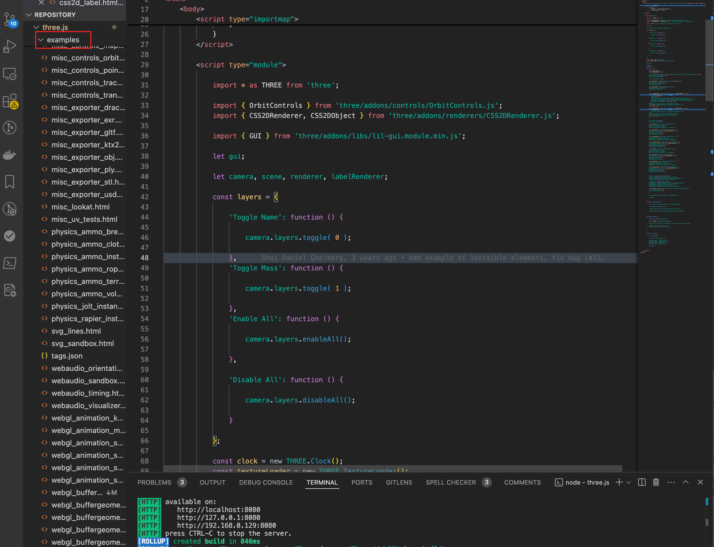
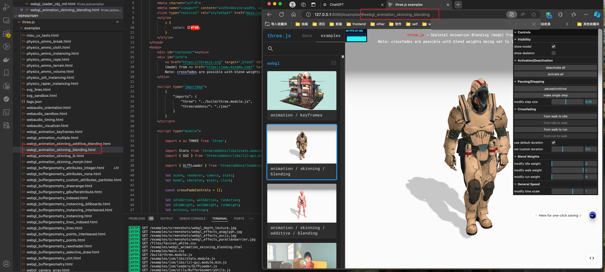
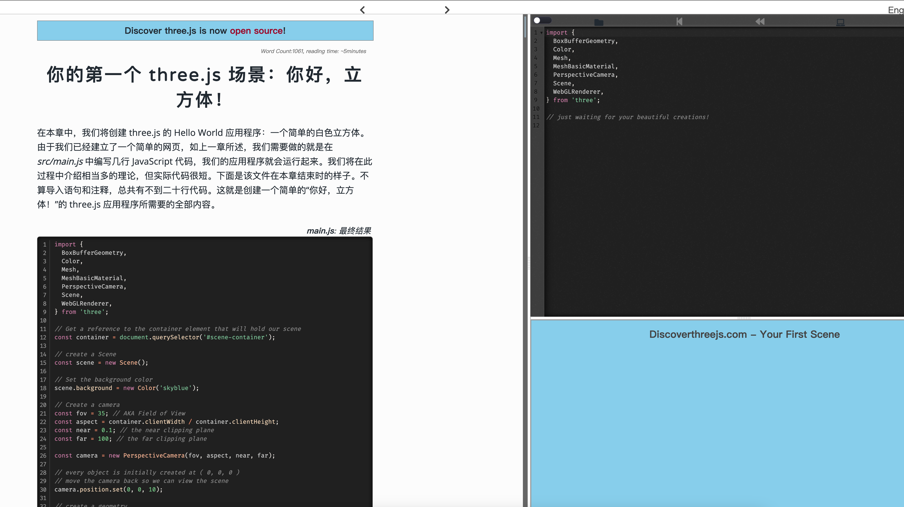
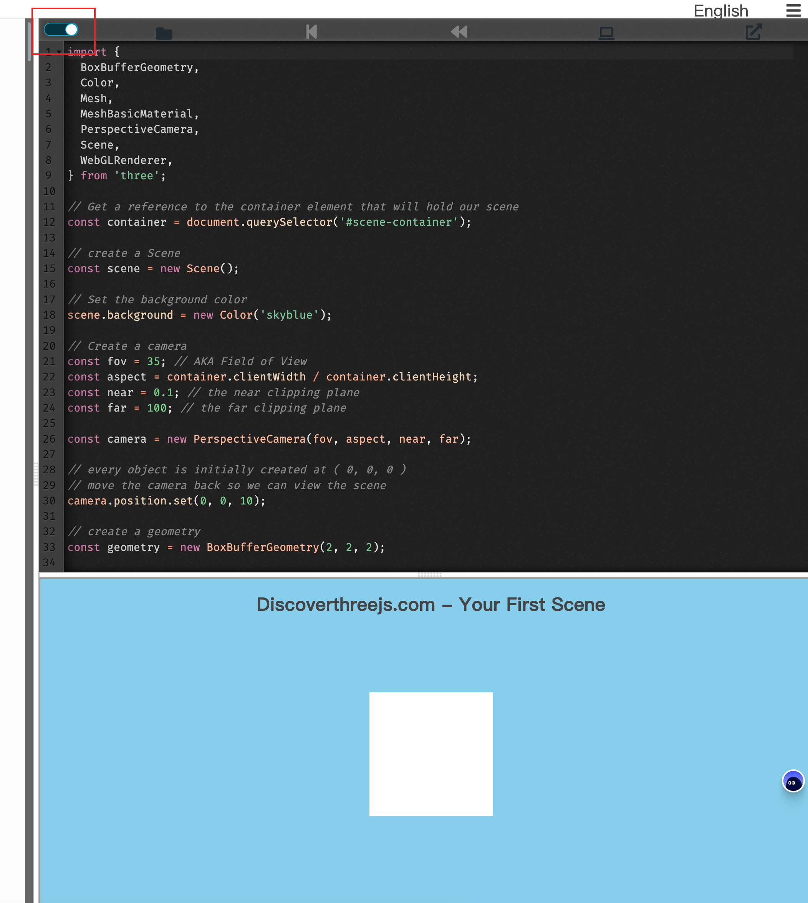

最近在学图形学的东西，感觉打开了一个新世界。这几年的前端工作给我的一个感受就是，做着前端的东西，但是好像离前端很远。

图形学虽然在浏览器上显示内容，但是实际上它是一个独立的领域，它有自己的理论和技术，这些技术和前端的技术有很多的交集，但是也有很多的不同。

如果一开始钻入图形学的话，可能会有很多的概念和技术需要学习，这样可能会让人望而生畏。但是如果一开始我们学习 Three.js 的话，可能会让我们的学习更加的轻松。

它是一个基于 WebGL 的 3D JavaScript 库，它使你可以在浏览器中创建 3D 图形。使用它可以实现很多的效果，而且实现起来也不是很复杂。等打好了兴趣，再去学习图形学的理论知识，可能会更加的轻松。

本系列的教程是基于 Three.js 的 0.170.0 版本，所以文章后面的案例代码都是基于这个版本的。
关于 170 可以的版本可以访问 fork 仓库 https://github.com/calmound/three.js-170

# 怎么开始学习 Three.js

1. 官方文档
   https://threejs.org/docs/index.html#manual/zh/introduction/Creating-a-scene
   目前官方文档也有中文版
   ![[./image/1.png]]
   而且他也有丰富的案例
   ![[./image/2.png]]

对于这个项目，我们也可以本地去执行，进入他的代码仓库或者我上面的 fork 仓库，然后执行,进行 git clone

```bash
git clone https://github.com/calmound/three.js-170.git
```

之后执行

```
npm install
npm run dev
```

启动服务后，我们访问 http://localhost:8080 就可以看到官方的文档了
![[./image/1.png]]
之后，我们打开项目，查看 examples 文件夹，里面有很多的案例，我们可以通过这些案例来学习 Three.js


大家也可以看 url 的最后的路径名称，其实就是对应的案例文件的名字。


通过官网的案例大家可以找到自己想要的案例，然后去看源码，这样会更加的直观。

2. https://discoverthreejs.com/book/introduction/
   这是一个关于 threejs 入门的书籍，他不是简简单单就用文字描述，每个章节都从有对应的案例。这个网站是交互式的，跟着他的介绍一边看一边写代码。
   通过这个网站，首先减少了我们前期搭建环境的时间，而且他还有正确的代码对比。

比如，


上面图是其中的一个章节，他的页面分为三个部分，左侧是教程，右侧上班区域是代码编辑区，右侧下半部分是预览区域。在右侧写入的代码，可以实时的在下半部分看到效果。

当我店家，左上角的按钮之后，能够显出出完整的正确的代码，这样很容易一目了然，看到自己的代码和正确的代码的区别。



官网的案例比较适合当作字典查漏补缺，它配合官网的 API，有助于我们对于 API 的理解。但是第二个网站对于入门来说更加友好，更加容易上手。
