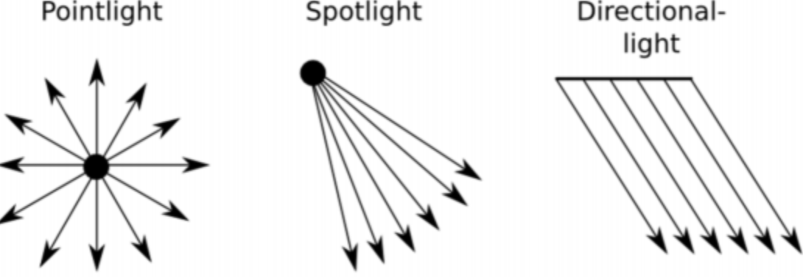
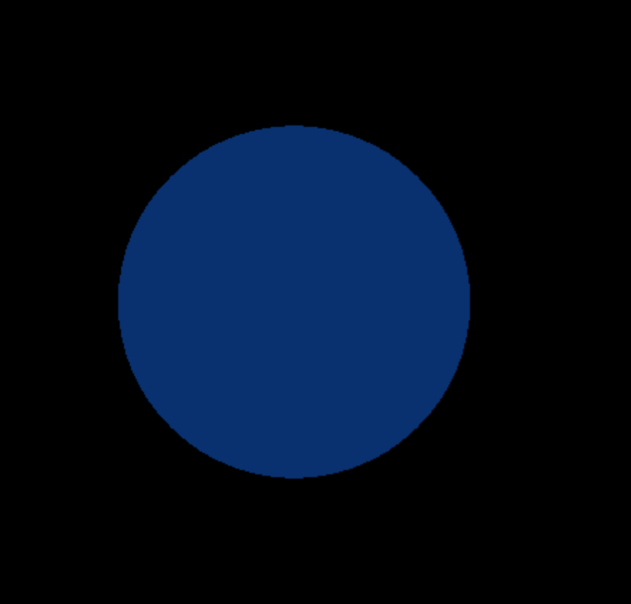
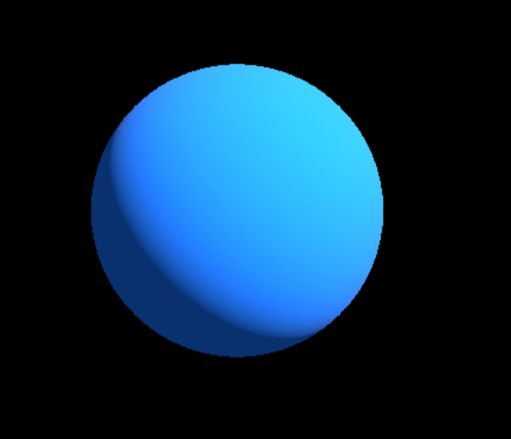
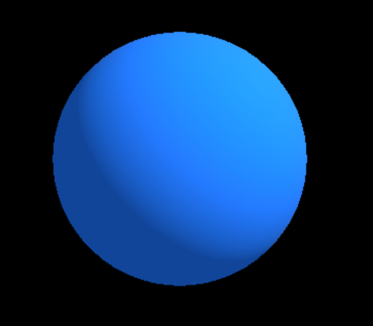

Three.js学习：https://www.threejs3d.com/

在 Three.js 中，灯光是非常重要的元素之一，它能够模拟现实世界中的光照效果，帮助我们打造更加真实的三维场景。灯光的种类和配置方式可以影响整个场景的视觉效果，在不同的应用中，灯光的使用非常关键。

# 灯光概述

Three.js 提供了几种常见的光源类型：环境光（Ambient Light）、平行光（Directional Light）、点光源（Point Light）、聚光灯（Spot Light）。每种光源类型都具有不同的光照特性，适用于不同的场景需求。



我们围绕一个球体案例，做灯光的讲解，首先，写入以下代码，创建一个球体。

```javascript
// 引入 Three.js 基础模块
import * as THREE from "three";
// 创建场景
const scene = new THREE.Scene();

// 创建相机 (视角：45度，宽高比，近裁剪面，远裁剪面)
const camera = new THREE.PerspectiveCamera(
  75,
  window.innerWidth / window.innerHeight,
  0.1,
  1000
);
camera.position.z = 5; // 设置相机位置

// 创建渲染器
const renderer = new THREE.WebGLRenderer();
renderer.setSize(window.innerWidth, window.innerHeight); // 设置渲染器大小
document.body.appendChild(renderer.domElement); // 将渲染器添加到页面中

// 创建球体
const geometry = new THREE.SphereGeometry(1, 32, 32); // 球体几何体
const material = new THREE.MeshStandardMaterial({ color: 0x0077ff }); // 球体材质，使用标准材质
const sphere = new THREE.Mesh(geometry, material); // 创建球体网格
scene.add(sphere); // 将球体添加到场景中

renderer.render(scene, camera);
```

通过上面的代码，我们已经创建一个场景、相机、渲染器和一个球体。但是运行起来环境是黑暗的，我们需要添加灯光来照亮场景。

## 环境光（Ambient Light）

环境光是最基础的一种光源，它不具备方向性，也不会产生阴影。它的作用是全局地照亮场景中的所有物体，确保没有完全黑暗的区域。环境光通常用于模拟场景中的“全局光照”，比如自然光在房间内的反射或天空光等。

### 特点

- **无方向性：** 环境光没有特定的方向，照亮所有物体的所有面。
- **无阴影：** 环境光不产生阴影，因为它是均匀的、全局的光。
- **全局光照：** 它在场景中均匀地影响所有物体，确保没有区域是完全黑暗的。
- **无法模拟光源的特定效果：** 由于环境光的均匀性，它无法模拟物体的光照衰减、反射或投射阴影，因此常常与其他类型的光源结合使用。

### 属性

```javascript
new THREE.AmbientLight(color, intensity);
```

1. **颜色（color）：**
   - 环境光的颜色，通常是一个十六进制颜色值。比如，`0xffffff` 表示白色光。你也可以设置其他颜色，来模拟不同光源的环境光效果。
2. **强度（intensity）：**
   - 环境光的强度，控制环境光的亮度。默认为 `1`，设置为 `0` 会导致没有环境光。调整强度可以影响场景整体的亮度，但不会改变场景中光源的方向性或阴影效果。

使用方式：

```javascript
const ambientLight = new THREE.AmbientLight(0xffffff, 0.5); // 环境光，颜色为白色，强度为0.5
scene.add(ambientLight); // 将环境光添加到场景中
```

在最开的时候代码中，增加环境光后，我们就的得到了


可以看到，球体被均匀地照亮，没有明显的阴影。球体看起来也不立体，因为没有明显的光照方向。

## 平行光（Directional Light）

平行光类似于太阳光，其光线是平行的并且没有衰减。它的方向性非常强，通常用于模拟太阳或远处的光源。平行光可以产生阴影，特别适用于需要光线均匀照射的场景。

### 特点

- **方向性：** 平行光的光线具有固定的方向，所有物体接收到的光线都是平行的，光线的源头位置并不重要。它模拟的是远离物体的光源，比如太阳光或星光，这些光源的光线几乎是平行的。
- **没有衰减：** 与点光源和聚光灯不同，平行光的强度不会随着距离的增加而衰减。光照强度在整个场景中是均匀的，无论光源距离物体有多远。
- **产生阴影：** 平行光可以产生阴影，适用于需要定向光照的场景。你可以控制阴影的质量、透明度和偏移量等参数。
- **用于模拟自然光：** 平行光常常用于模拟太阳光、月光或任何远处的恒定光源，它对整个场景的照明影响均匀，不会因为物体的大小或距离而发生变化。

### 属性

```javascript
new THREE.DirectionalLight(color, intensity);
```

1. **颜色（color）：** 设置平行光的颜色，可以是一个十六进制的颜色值或 `THREE.Color` 对象。默认是白色（`0xffffff`）。
2. **强度（intensity）：** 设置光源的强度，默认为 `1`。调整这个值可以控制光的亮度。

使用方式：

```javascript
const directionalLight = new THREE.DirectionalLight(0xffffff, 10);
directionalLight.position.set(10, 10, 10); // 设置光源的位置
scene.add(directionalLight);
```



可以看到，加入了平行光后，球体的光照效果更加立体，有了明显的高光和阴影。光线的方向性也使得球体的表面更加立体感。

## 点光源（Point Light）

点光源是从一个特定点发射光线，光线会以球形的方式扩散开来。点光源会随着距离的增加而衰减，因此可以模拟类似灯泡的效果。点光源通常用于场景中的局部照明。

### 特点

- **光源位置：** 点光源从一个特定的位置发出光线，光线向所有方向均匀传播。你可以通过设置点光源的 `position` 属性来定义光源的位置。
- **光照衰减：** 点光源的光照强度会随着距离光源的远近而衰减，通常会使用距离衰减模型（如平方反比衰减）来模拟自然界中的光照衰减。它的亮度会随着距离的增加逐渐减弱。
- **产生阴影：** 点光源可以产生阴影，这使得场景的光照效果更加立体和真实。通过配置 `castShadow` 属性，可以控制是否启用阴影。
- **全向光照：** 点光源向四面八方发射光线，照亮周围的物体，适用于模拟小范围的局部光源。

### 属性

```javascript
new THREE.PointLight(color, intensity, distance, decay);
```

- **颜色（color）：** 设置光源的颜色，通常使用十六进制颜色值。默认是白色（`0xffffff`）。
- **强度（intensity）：** 设置光源的亮度，默认是 `1`。增大强度会使光源变得更亮，减小则变暗。
- **距离（distance）：** 设置光照的衰减范围。光照的强度随着距离的增加而减弱。如果设置为 `0`，光源会无限制地照亮场景中的所有物体。
- **衰减（decay）：** 控制光照衰减的速率，默认值为 `2`。较大的衰减值会让光照更快衰减。
  使用方式：

```javascript
const pointLight = new THREE.PointLight(0xffffff, 300, 0); // 点光源，颜色为白色，强度为200, 距离为0
pointLight.position.set(5, 5, 5);
scene.add(pointLight);
```



点光源和平行光，虽然都可以产生阴影。但是我们在使用场景上还是有区别的，从场景考虑，点光源更适合模拟局部光源，比如台灯、蜡烛等，而平行光更适合模拟远处的光源，比如太阳光。

| **特点**         | **点光源（Point Light）**                    | **平行光（Directional Light）**                        |
| ---------------- | -------------------------------------------- | ------------------------------------------------------ |
| **光源类型**     | 发光点，在场景中有位置                       | 无位置的平行光线，模拟远处的光源                       |
| **光线传播**     | 向四面八方发射光线                           | 光线是平行的，所有光线方向相同                         |
| **光照衰减**     | 会随着距离衰减，强度会减弱                   | 不衰减，光照强度保持恒定                               |
| **光照方向**     | 所有物体会被均匀照亮，方向是从光源向外发散   | 所有物体的光照方向相同，具有明确的方向性               |
| **光源位置**     | 光源的位置是可设置的                         | 无固定位置，光源的方向决定了光照的方向                 |
| **适用场景**     | 局部光源，模拟台灯、蜡烛、手电筒等小范围照明 | 模拟日光、远处的光源、大范围照明（如太阳光）           |
| **是否影响阴影** | 会根据距离和位置影响阴影的强度和方向         | 影响阴影的方向，所有物体投射的阴影方向相同，但没有衰减 |
| **常见用途**     | 小范围局部照明、汽车灯光、室内灯光等         | 太阳光、远光灯、大范围均匀照明                         |

## 聚光灯（Spot Light）

聚光灯（Spotlight）是一种具有方向性的光源，其光线从一个特定的点发射，并且有一个锥形的照射范围。它通常用于模拟舞台灯光、手电筒、汽车头灯等聚焦的光源。与点光源（Point Light）和平行光（Directional Light）不同，聚光灯具有**可调节的照射角度**和**聚焦范围**，并且可以设置光的衰减效果。

### 特点

1. **光源位置与方向：**
   - 聚光灯是从一个点发射光线的，通常需要设置光源的位置，并通过 `target` 属性指定光源的照射方向。
   - 聚光灯的光线形成一个锥形区域，只有这个区域内的物体能够被照亮。
2. **光照范围：**
   - 聚光灯的光照范围是可调的，可以通过 **角度** (`angle`) 来控制光锥的宽度。
   - 你可以设置 **衰减范围** (`distance` 和 `decay`)，控制光源的影响范围和衰减速率。
3. **锥形区域：**
   - 聚光灯的光照效果是锥形的，指定了一个 **内角** (`angle`) 和 **外角** (`penumbra`)。
     - `angle` 控制了光锥的半角。
     - `penumbra` 控制了光锥的边缘模糊程度，值为 0 到 1 之间的浮动值，0 表示边缘清晰，1 表示边缘完全模糊。
4. **光照衰减：**
   - 与点光源相似，聚光灯也具有衰减效果。随着距离的增加，光源的强度会衰减。
   - 你可以调整 **衰减距离** (`distance`) 和 **衰减系数** (`decay`)，来设置光照的强度和范围。
5. **阴影：**
   - 聚光灯可以投射阴影，适合用来创建光照集中在某个区域的效果。

#### 场景

1. **舞台照明：** 聚光灯通常用于舞台表演，照亮特定区域或演员，使其更加突出。
2. **汽车前灯：** 汽车头灯可以模拟聚光灯的效果，用来照亮前方的道路。
3. **手电筒或探照灯：** 手电筒的光照范围通常是锥形的，类似于聚光灯，适合用来照亮小范围区域。
4. **游戏中的聚焦效果：** 在游戏或虚拟现实中，可以用聚光灯来突出显示某些重要物体或区域，比如在关卡中照亮目标物体或道具。
5. **灯光特效：** 在建筑可视化或电影制作中，聚光灯常常用于创建某种特殊的光影效果，例如光束穿透烟雾或光斑效果。

#### 属性

```javascript
new THREE.SpotLight(color, intensity, distance, angle, penumbra, decay);
```

- **color**: 光源的颜色，默认为 `0xffffff`（白色）。
- **intensity**: 光源的强度，默认为 `1`。
- **distance**: 光源的照射范围，默认为 `0`，即光源的光照没有限制。
- **angle**: 光锥的开口角度，单位为弧度。默认值是 `Math.PI / 3`（60 度）。
- **penumbra**: 控制光锥边缘的模糊程度，值在 `0` 到 `1` 之间，`0` 表示锐利的边缘，`1` 表示完全模糊的边缘。
- **decay**: 控制光照的衰减速率，默认为 `2`。

使用方式：

```javascript
const spotLight = new THREE.SpotLight(0xffffff, 1);
spotLight.position.set(10, 10, 10);
spotLight.target = scene; // 设置聚光灯的目标
scene.add(spotLight); 5. 区域光（RectArea Light）
```

# 灯光的属性与配置

每种光源除了位置和强度之外，还有很多可以调整的属性。了解这些属性，有助于我们更好地控制场景中的光照效果。

1. 颜色与强度
   光源的颜色决定了它照射的光线的颜色，强度决定了光线的亮度。通常，白色光线的强度会影响场景的亮度，而颜色的改变会影响整体的色调。

调整颜色和强度：

```javascript
const directionalLight = new THREE.DirectionalLight(0xffffff, 1); // 强度为 1
directionalLight.color.set(0xff0000); // 设置光源为红色 2. 光衰减
```

光源通常会随着距离的增加而衰减。点光源和聚光灯都可以设置衰减因子，模拟现实世界中光线衰减的效果。衰减通常包括常规衰减（距离的平方）和最大衰减距离。

点光源衰减：

```javascript
const pointLight = new THREE.PointLight(0xffffff, 1, 100); // 衰减距离为 100 3. 阴影
```

某些光源（如平行光、点光源和聚光灯）能够产生阴影。阴影的产生有助于提高场景的真实感。我们可以设置光源产生阴影的开关、阴影的强度以及阴影的质量。

设置阴影：

```javascript
directionalLight.castShadow = true; // 开启阴影
renderer.shadowMap.enabled = true; // 开启渲染器的阴影映射 4. 光线投射
```

聚光灯的投射角度可以通过 angle 和 penumbra 控制，angle 设置聚光灯的锥形角度，penumbra 用于调整边缘的柔和度。

设置聚光灯的投射角度：

```javascript
spotLight.angle = Math.PI / 4; // 设置聚光灯的角度为 45 度
spotLight.penumbra = 0.2; // 设置阴影边缘柔和度
```

# 灯光的进阶应用

除了基础的光照效果外，Three.js 还允许我们使用光源与材质的结合，创造出更加复杂的光影效果。在此部分，我们将介绍一些常见的进阶技巧。

1. 光照贴图
   **光照贴图**（Lightmap）是一种预计算的光照信息纹理，它可以存储光照、阴影和反射等信息，并将这些信息应用到模型的表面。这种技术常用于静态场景中，特别是在场景的复杂计算（如全局光照、阴影等）较为消耗性能时，通过光照贴图可以大大提高渲染效率。

2. HDR 环境光贴图
   **HDR 环境光贴图**（High Dynamic Range environment map）是一种高动态范围的纹理，它包含了更多的亮度和细节，能够真实地模拟环境中的光照效果。HDR 环境光贴图通常用于提供更高质量的反射、光照效果，适用于更真实的图像渲染。

3. 反射与折射
   反射和折射是通过灯光与物体表面相互作用产生的效果。在 Three.js 中，我们可以使用镜面反射或折射来增加场景的真实感。

4. 光源的动画效果
   灯光的动态效果可以通过修改光源的属性（如位置、颜色、强度等）来实现。Three.js 提供了丰富的动画机制，结合光源的属性，可以制作出非常丰富的灯光动态效果。

   **常见的灯光动画：**

   - **闪烁效果：** 模拟灯光的闪烁，例如模拟霓虹灯或电灯的闪烁。
   - **渐变效果：** 灯光的强度或颜色渐变，模拟灯光的逐渐变亮或变暗。
   - **移动光源：** 让光源在场景中移动，模拟手电筒、车灯等效果。


