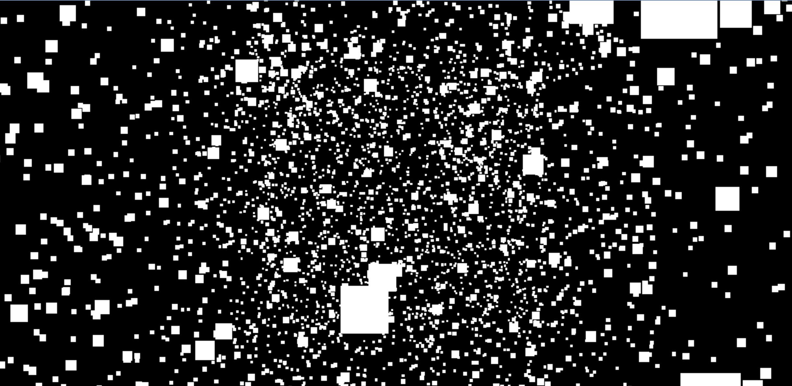

在前端 3D 开发中，粒子效果是一种非常灵活且炫酷的表现形式，广泛应用于动态背景、特效模拟和交互场景中。今天，我们就来通过 Three.js 探索粒子的魅力，带你从基础知识入手，逐步创建一个令人惊叹的粒子效果。

---

## 粒子效果的原理简介

粒子效果本质上是一组微小的几何体，通过特定的逻辑动态渲染。它们通常具有以下特点：

1. 数量众多，通常达到上千甚至上万。
2. 尺寸小，多为点或小平面。
3. 拥有个性化属性，如颜色、速度、生命周期等。

在 Three.js 中，我们可以使用 **`Points`** 类来创建粒子效果，它能够高效地渲染大量点状几何体。

---

## 搭建基础粒子效果

#### 1. 初始化场景

首先，我们需要创建 Three.js 的基本场景，包括渲染器、摄像机和场景对象。

```javascript
import * as THREE from "three";

// 创建场景
const scene = new THREE.Scene();

// 创建摄像机
const camera = new THREE.PerspectiveCamera(
  75,
  window.innerWidth / window.innerHeight,
  0.1,
  1000
);
camera.position.z = 5;

// 创建渲染器
const renderer = new THREE.WebGLRenderer();
renderer.setSize(window.innerWidth, window.innerHeight);
document.body.appendChild(renderer.domElement);
```

#### 2. 添加粒子系统

1. 我们使用`BufferGeometry`来创建粒子的几何体,定义生成的粒子数量为 5000

```javascript
const particlesGeometry = new THREE.BufferGeometry();
const particlesCount = 5000; // **粒子数量**
```

2. 为每个粒子生成随机位置,在 Threee.js 用 xyz 三个坐标来表示一个点的位置，我们使用 positions 数组来存储所有粒子的位置信息，每个粒子有 x、y、z 三个坐标，所以数组的长度是 `particlesCount * 3`。

   所以，pōsitions 数组的结构如下：

```javascript
[ x1, y1, z1, x2, y2, z2, ... ]
```

代码如下：

```javascript
const positions = new Float32Array(particlesCount * 3);
for (let i = 0; i < particlesCount * 3; i++) {
  positions[i] = (Math.random() - 0.5) * 10; // 生成-5到5的范围的随机位置
}
```

3. 将位置信息添加到粒子几何体中, 通过 `setAttribute` 方法将位置信息添加到粒子几何体中。使用 `BufferAttribute` 类来创建一个新的属性，属性名称为 `position`，数据类型为 `Float32Array`，每个属性有 3 个值。

```javascript
particlesGeometry.setAttribute(
  "position",
  new THREE.BufferAttribute(positions, 3)
);
```

4. 创建粒子材质, 通过 `PointsMaterial` 类来创建粒子的材质，设置粒子的颜色和尺寸。

```javascript
const particlesMaterial = new THREE.PointsMaterial({
  color: 0xffffff, // 粒子颜色
  size: 0.1, // 粒子尺寸
});
```

5. 创建粒子系统, 通过 `Points` 类来创建粒子系统，将粒子几何体和粒子材质传入构造函数中。

```javascript
const particles = new THREE.Points(particlesGeometry, particlesMaterial);
scene.add(particles);
```

完整代码如下：

```javascript
// 创建粒子几何体
const particlesGeometry = new THREE.BufferGeometry();
const particlesCount = 5000; // **粒子数量**

// 定义粒子位置
const positions = new Float32Array(particlesCount * 3); // 每个粒子有x、y、z三个坐标
for (let i = 0; i < particlesCount * 3; i++) {
  positions[i] = (Math.random() - 0.5) * 10; // 生成随机位置
}

// 将位置添加到几何体
particlesGeometry.setAttribute(
  "position",
  new THREE.BufferAttribute(positions, 3)
);

// 创建粒子材质
const particlesMaterial = new THREE.PointsMaterial({
  color: 0xffffff, // 粒子颜色
  size: 0.1, // 粒子尺寸
});

// 创建粒子系统
const particles = new THREE.Points(particlesGeometry, particlesMaterial);
scene.add(particles);
```

到此为止，我们就可以看到一片白色的粒子效果了。



#### 3. 动画效果

接下来，我们为粒子效果添加动画效果，让粒子旋转起来。

```javascript
function animate() {
  requestAnimationFrame(animate);

  // 粒子旋转
  particles.rotation.y += 0.002;

  renderer.render(scene, camera);
}

animate();
```

运行这段代码，你会看到一片缓缓旋转的星空，给人一种深邃的宇宙感。


## 个性化粒子效果

#### 1. 粒子颜色渐变

通过自定义顶点着色器和片段着色器，可以为每个粒子赋予独特的颜色。这里我们将 PointsMaterial 替换为 ShaderMaterial，并在着色器中为粒子赋予渐变色。下面是 glsl 的代码，不熟悉可以先忽略，知道下面的代码的作用就是为粒子赋予渐变色即可。

```javascript
import { ShaderMaterial } from "three";

// 粒子材质着色器
const particlesShaderMaterial = new ShaderMaterial({
  vertexShader: `
    varying vec3 vColor;
    void main() {
      vColor = position;
      gl_Position = projectionMatrix * modelViewMatrix * vec4(position, 1.0);
      gl_PointSize = 4.0;
    }
  `,
  fragmentShader: `
    varying vec3 vColor;
    void main() {
      gl_FragColor = vec4(vColor, 1.0);
    }
  `,
});

const colorfulParticles = new THREE.Points(
  particlesGeometry,
  particlesShaderMaterial
);
scene.add(colorfulParticles);
```

在这里，我们使用粒子的 `position` 值为其生成渐变色，给人一种流光溢彩的视觉效果。

