在我们做数字孪生相关的项目的时候，会需要生成一些城市的模型，这时候我们可以使用 blender 来生成一些城市的模型。

我们，先来看一下效果。

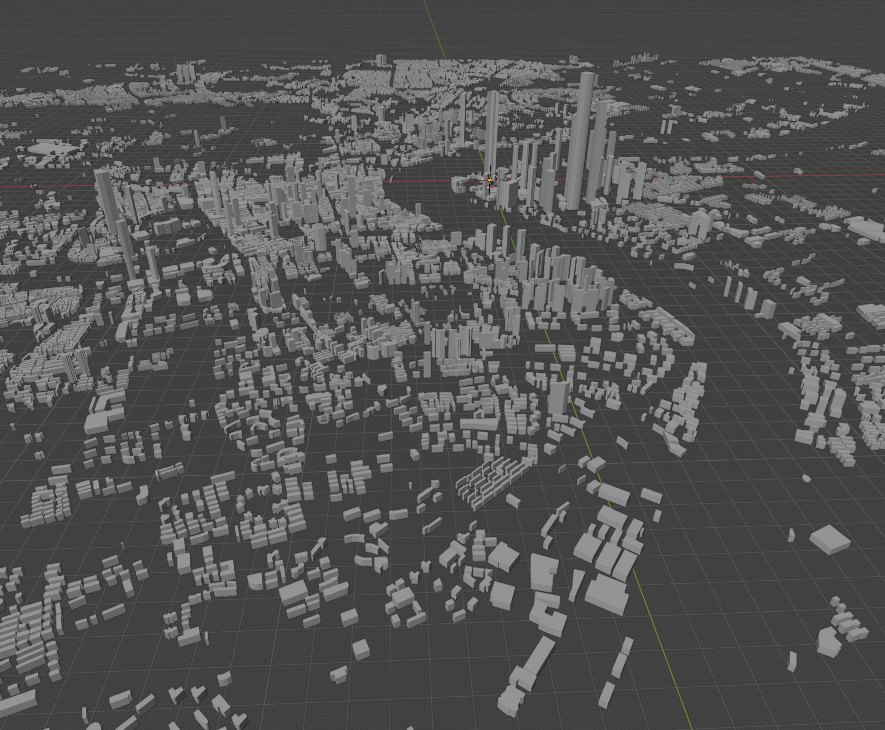

# 安装 blender

blender 是一个开源的 3D 建模软件，可以在官网下载到最新的版本，下载地址为：[https://www.blender.org/download/](https://www.blender.org/download/)

下载完成后，安装即可,打开后可以看到如下界面。

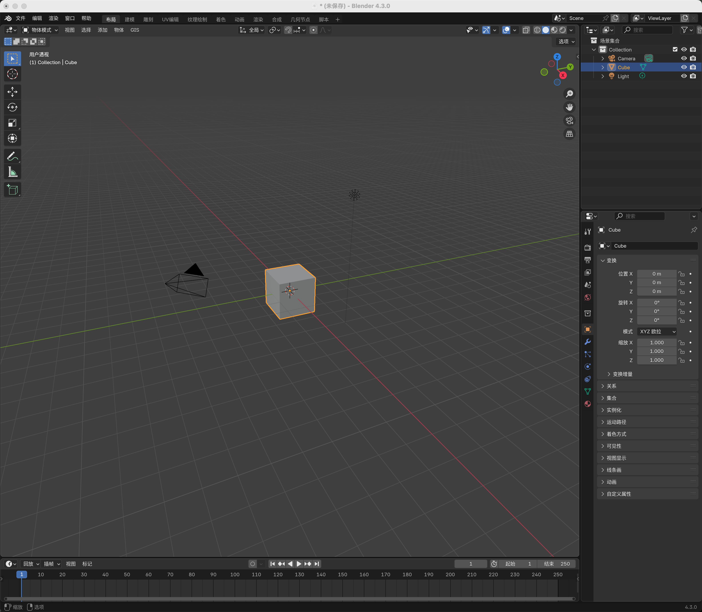

默认下载的可能是英文的，大家可以编辑 `Edit` -> `Preferences` -> `Interface` -> `Language` -> `Chinese` 来修改为中文。
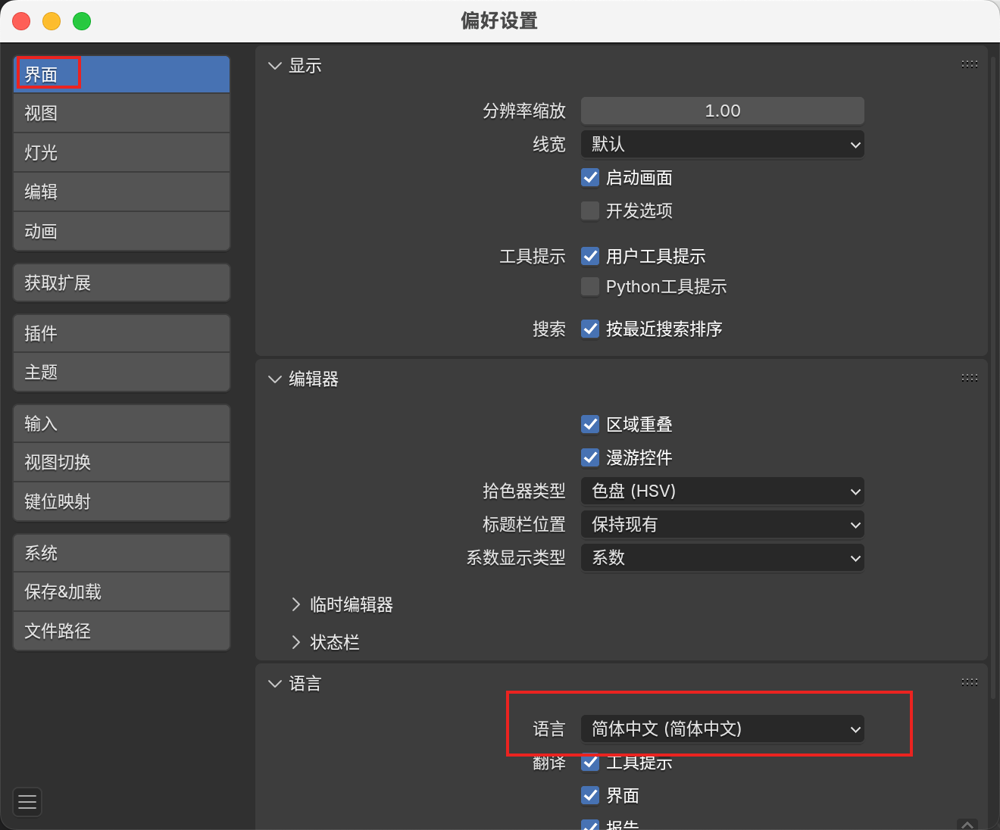

# 安装 BlenderGIS

下载地址：https://github.com/domlysz/BlenderGIS

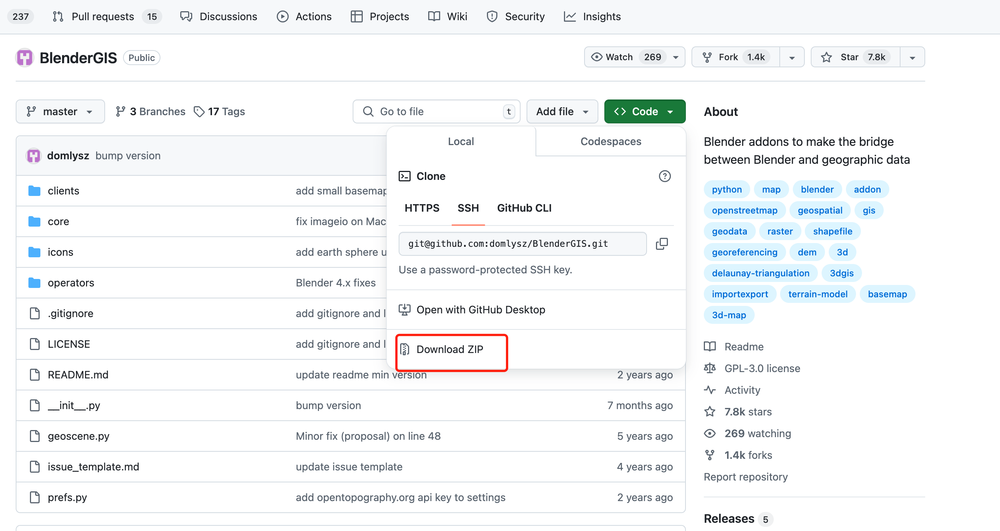
下载完成后不需要解压，直接在 blender 中安装即可。
还是在偏好设置弹窗中，选择插件，然后在右上角从磁盘安装，选择下载的 zip 文件即可。
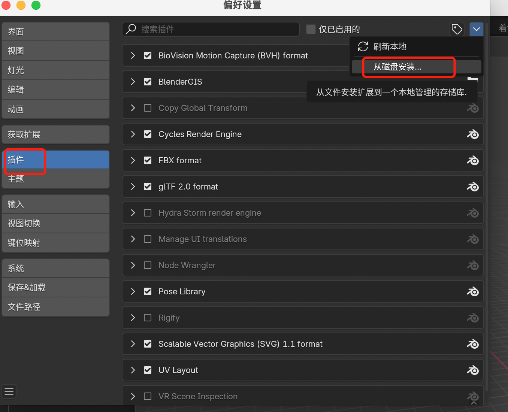

安装完成后，将这个插件启用，然后重启 blender 即可。
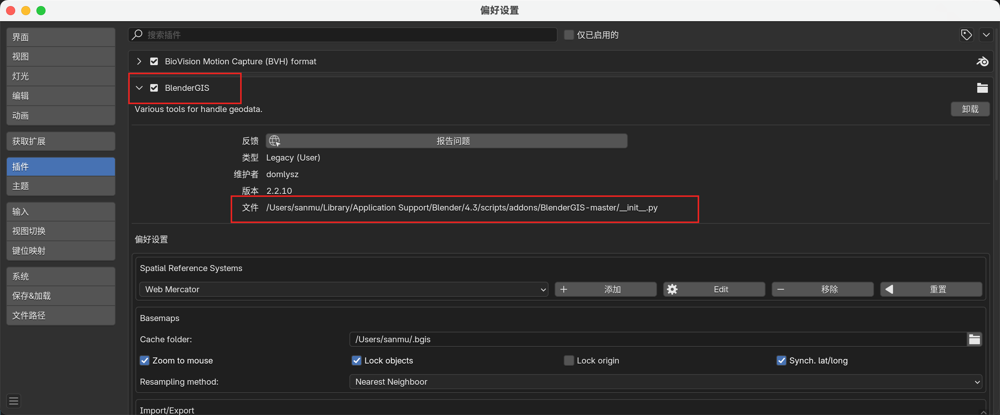

文件的这个路径记下来，等会会有用。

我们在 Blender 的顶部菜单栏中，可以看到一个 GIS 的选项，这个就是我们刚刚安装的插件。
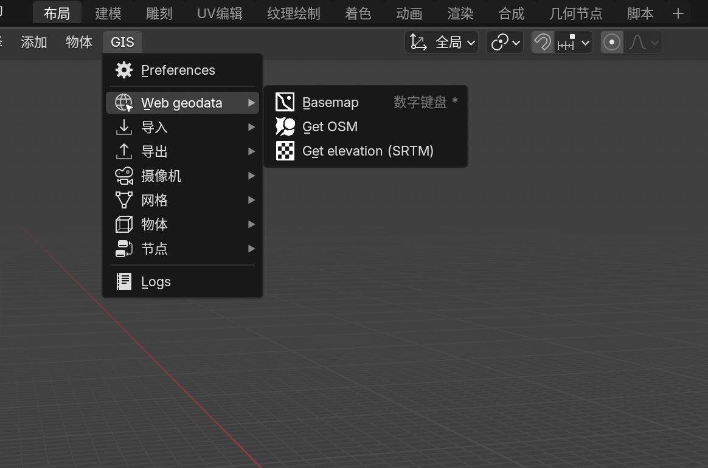

这个时候点击 web geodata，然后选择 Basemap，会报错
提示
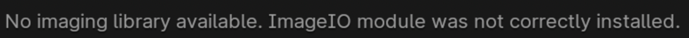

```
No imaging library available. ImageIO module was not correctly installed
```

如果遇到这个错误，我们还安装一个东西，freeimage

# 安装 freeimage

https://github.com/imageio/imageio-binaries/tree/master/freeimage
从上面的连接找到对应的版本，然后下载。
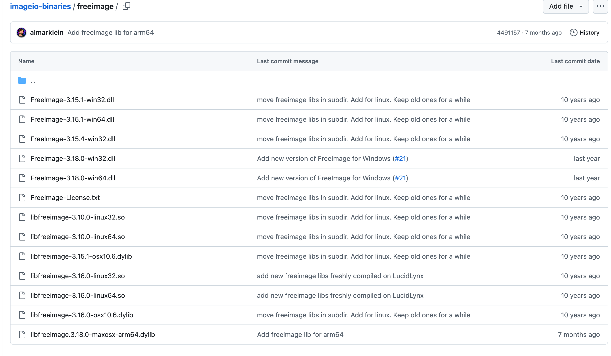

我是 mac，所以下载的最后一个。

完成下载后，还记得我们之前安装的 BlenderGIS 插件的路径吗？我们将下载的文件解压到这个路径下。

这里给出 mac 如何进入这个目录，windows 的话，需要自己去查询一下。

打开访达，我们可以摁住 option 键，然后点击前往，就可以看到资源库了。
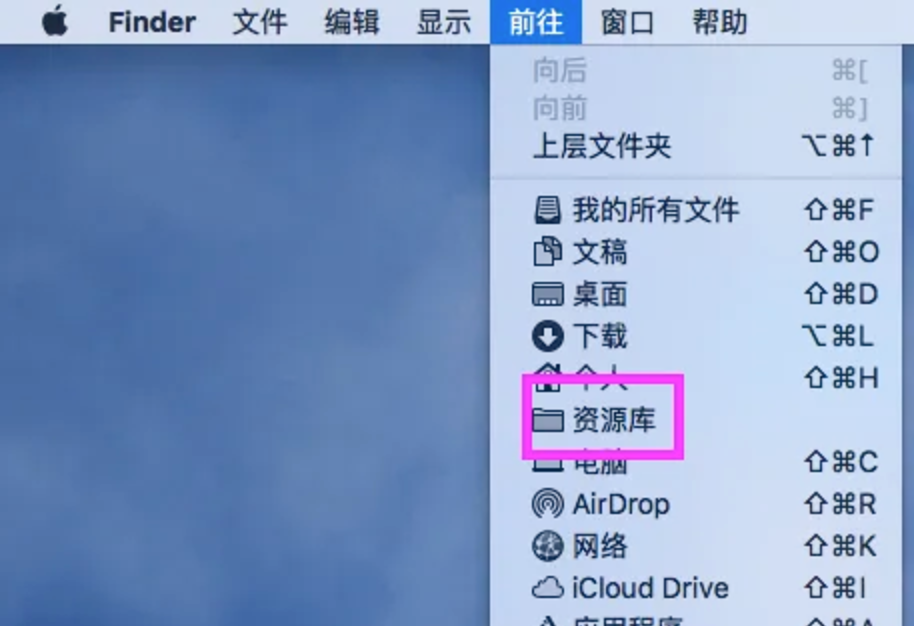

依次进入到这个路径下

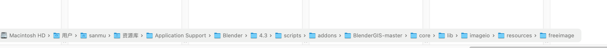

```
/Users/sanmu/Library/Application Support/Blender/4.3/scripts/addons/BlenderGIS-master/core/lib/imageio/resources
```

到达这个目录后，我们需要手动创建一个文件夹 freeimage。

然后将我们刚下载的文件放到 freemie 文件夹中。

这样准备工作就都好了。

# 生成城市模型

重启我们的 blender，然后点击 web geodata，选择 basemap，出现下面的弹窗。

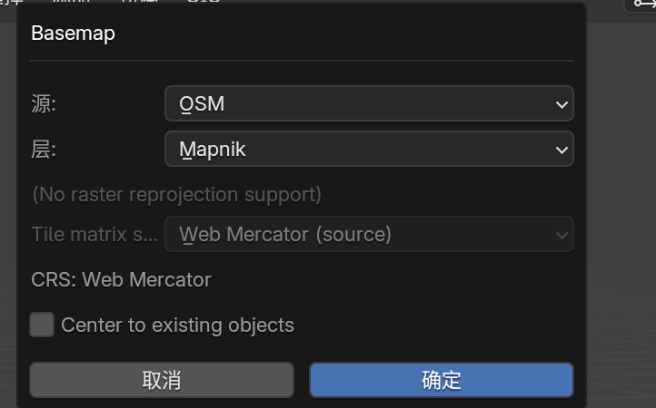

将源修改为 OSM 后，点击确定

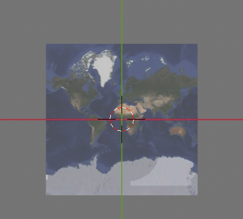

我们就得到了这个数据了，可以进行放大缩小。

然后通过快捷键，command + G,会出现一个弹窗，通过它我们可以去具体的城市。

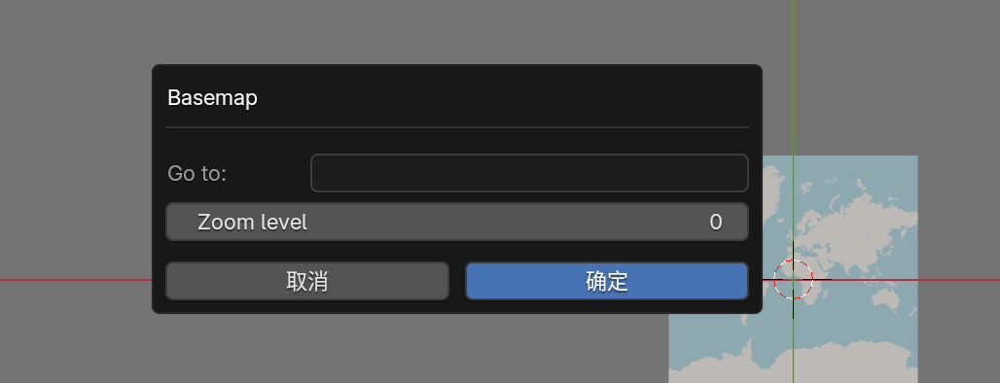

我们输入一个位置后，确定
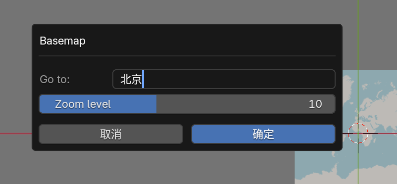

等待一会就定位到我们输入的位置坐标了。


我们使用鼠标滚轮进行放大缩小

最后获取建筑的模型，我们点击 web geodata，选择 buildings，然后点击确定。
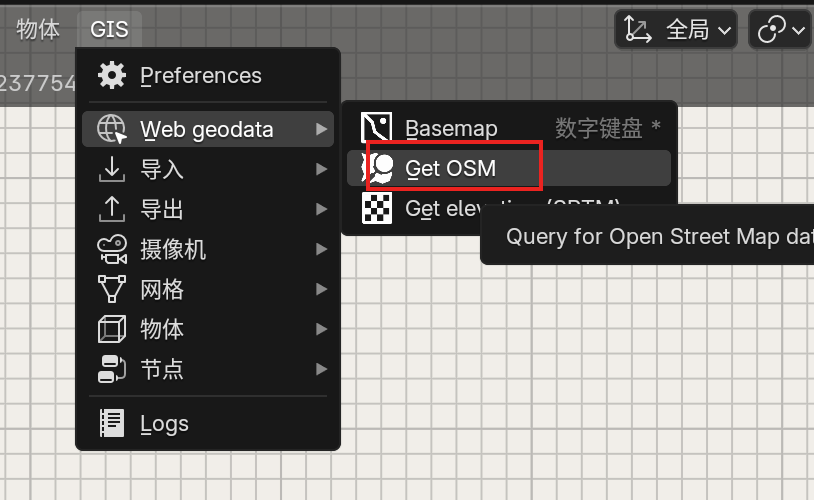

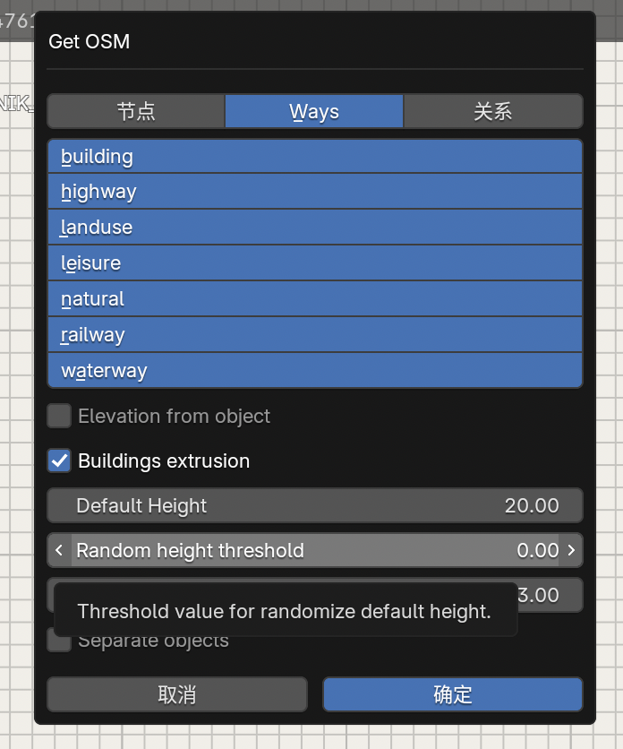

等待一会，我们生成的如下的内容

然后我们点击背后的图片删掉，我们在移动城市的位置，就获得城市群了

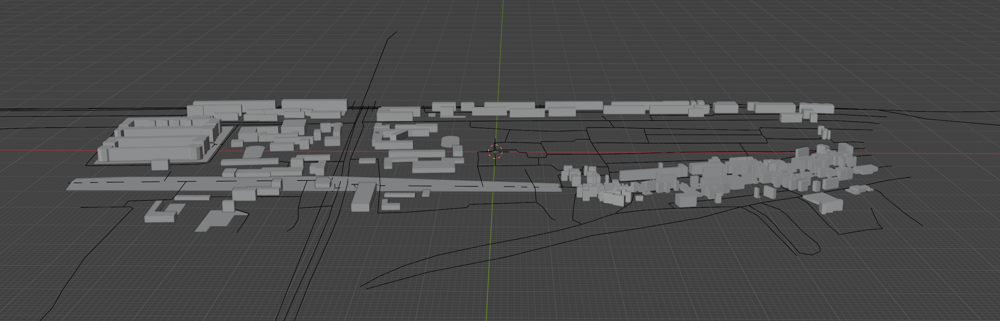
