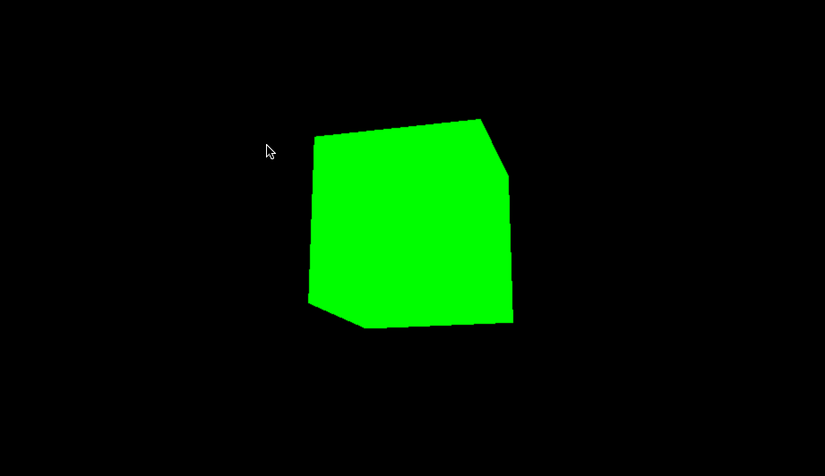
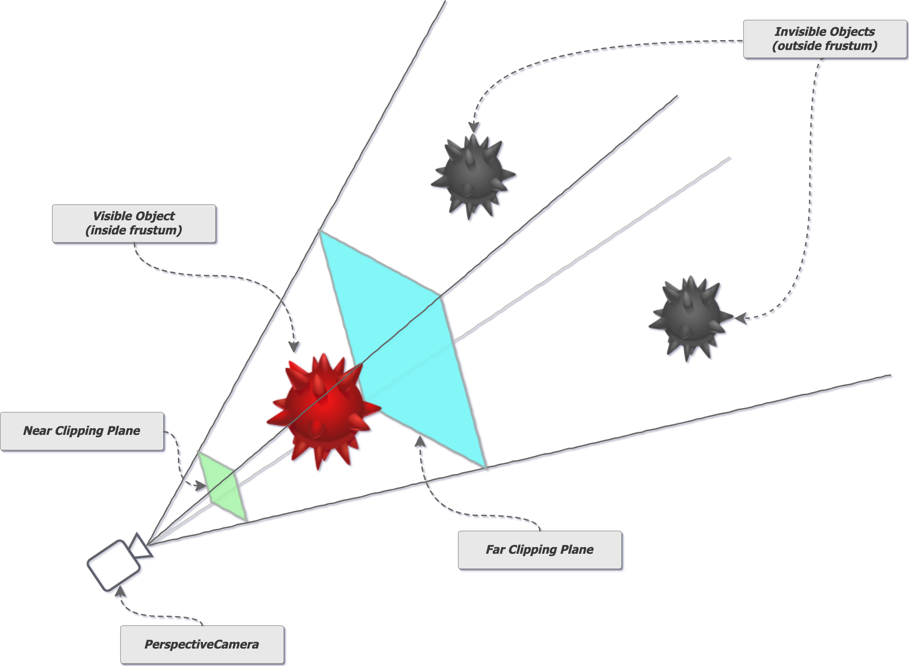
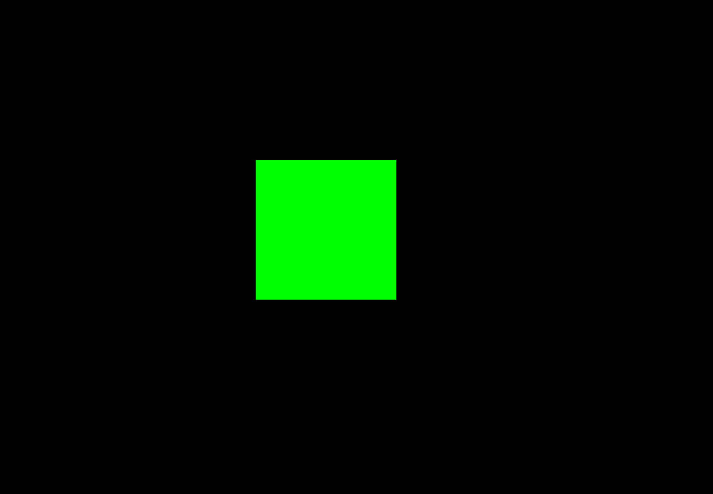

今天会用一个例子，带大家来一起走一遍 Threejs 最基础的功能，我们会建一个方盒子。

通过这个例子，你会学到如何

- 创建一个场景
- 如何创建一个相机
- 如何创建一个渲染器
- 如何创建一个立方体
- 如何将立方体添加到场景中

先来看下最后完成的效果如下

关于怎么创建项目， 可以看上一篇文章，[链接](https://mp.weixin.qq.com/s?__biz=MzIxNDI5MTc0MA==&mid=2247484594&idx=1&sn=a5f778734bc22ce9e4d8d35d8da13c39&chksm=97a880c1a0df09d72851147425145f0e0c781f505ab52c775ecbf272776106ff7ab4da0252c6&token=1906193461&lang=zh_CN#rd)。这里我们使用 vite 来创建项目。

在写代码之前，我们来了解一些 3D 的概念。

# 基础介绍

## 什么是场景

场景可以理解成一个容器，里面可以放置很多物体，比如立方体、球体、光源等。场景是所有 3D 元素的容器，所有的 3D 元素都是放在场景中的。在 Threejs 以及其他 3D 引擎中，场景是一个很重要的概念。

在我们开始添加物体之前，我们需要先创建一个场景。很多时候，如果你想添加的物体没有在场景中显示，那么可以检查一下是不是没有将物体添加到场景中。

## 为什么需要相机

有了场景了，相当于有了我们的世界，但是我们还需要一样东西，去观察这个世界，这个东西就是相机。相机是用来观察场景的，如果没有相机，我们是看不到场景的。

所以相机相当于我们的眼睛，我们可以通过相机的位置、视角等属性来观察场景。

我们通过相机来观察场景，通过操作相机，通过一系列的操作，比如移动相机、旋转相机来展示我们想要的场景。

## 什么是渲染器

Three.js 的渲染器是用来把 3D 场景显示到网页上的工具。它的作用就像一个画家，把场景里的物体按照摄像机的角度“画”到屏幕上。最常用的是 WebGLRenderer，它利用浏览器的 WebGL 技术，让画面更快更真实。你可以通过设置渲染器，比如分辨率、是否需要平滑边缘（抗锯齿），来调整画面的效果和流畅度。简单来说，渲染器就是 Three.js 的“画笔”，帮你把 3D 世界变成能看的画面。

## 渲染器和相机的关系

在 Three.js 中，渲染器和相机的关系非常重要。它们共同决定了 3D 场景是如何被显示到屏幕上的：

相机就像人的眼睛，决定了你从哪个角度、位置和范围去看这个 3D 场景。

渲染器负责把相机“看到”的内容画到屏幕上。它会根据场景、相机的位置和角度，计算出每个物体的外观，然后显示成一个 2D 图像。

相机决定“看什么”（场景中的哪些物体、从什么角度看）。渲染器决定“怎么画”（把相机看到的东西显示在屏幕上）。

通俗地说，相机是“眼睛”，渲染器是“画手”，它们一起完成了从 3D 场景到屏幕图像的过程。没有相机，渲染器不知道该画什么；没有渲染器，相机看到的东西无法展示出来。

好了，到此为止，我们科普了一些最基础的概念。下面我们来看看如何通过代码来实现一个 3D 方盒子。

# 立方体实现

在 main.js 中引入 three.js

```javascript
import * as THREE from "three";
```

## 创建场景

首先，我们需要创建一个场景：

```javascript
const scene = new THREE.Scene();
```

## 创建相机

接下来，我们创建一个透视相机：

```javascript
const camera = new THREE.PerspectiveCamera(
  75,
  window.innerWidth / window.innerHeight,
  0.1,
  1000
);
camera.position.z = 5;
```

上面的代码含义是，创建一个透视相机，视角是 75 度，宽高比是窗口的宽高比，视锥体的近端是 0.1，远端是 1000。然后将相机的 z 坐标设置为 5，这样相机就在 z 轴上离场景 5 个单位的位置。


我们用一张图来理解，上面的绿色部分就是近端，蓝色部分就是远端，中间红色的球体部分就是相机的可视区域，对于最右侧的灰色的球体，相机是看不到的。

所以我们在设计相机数值，以及摆放我们物体的时候，都要考虑到这个可视区域。

视角毫无疑问，当视角越大，我们看到的东西就越多。

## 创建画布元素

现在，我们已经有了场景和相机，接下来我们需要一个画布元素来显示场景。我们可以通过创建一个 canvas 元素并将其添加到文档中来实现：

```javascript
const canvas = document.createElement("canvas");
document.body.appendChild(canvas);
```

## 创建渲染器

接下来，我们创建一个 WebGL 渲染器，并设置其大小：

```javascript
const renderer = new THREE.WebGLRenderer({ canvas });
renderer.setSize(window.innerWidth, window.innerHeight);
```

## 处理窗口大小调整

对于上面的代码，一旦我们调整窗口大小，画布的大小就不会改变，所以我们需要在窗口大小调整时更新渲染器和相机。

为了在窗口大小调整时更新渲染器和相机，我们添加一个事件监听器 resize，如下所示：

```javascript
window.addEventListener("resize", () => {
  renderer.setSize(window.innerWidth, window.innerHeight);
  camera.aspect = window.innerWidth / window.innerHeight;
  camera.updateProjectionMatrix();
});
```

这段代码就是说，当我们调整窗口大小的时候，我们需要重新设置渲染器的大小，然后重新设置相机的宽高比，最后更新相机的投影矩阵。
这里设置的大小就是浏览器的大小，也就是 window.innerWidth 和 window.innerHeight。

## 创建几何体

到此为止，我们已经有了基础的东西了，接下来开始上我们的主角。

我们创建一个立方体的几何体：

```javascript
const geometry = new THREE.BoxGeometry();
```

## 创建材质

有了立方体，但是它是没有颜色的，我们需要给它添加一个材质，这样它才能有颜色。

我们创建一个基本材质，并设置其颜色为绿色，这里的颜色使用十六进制表示：

```javascript
const material = new THREE.MeshBasicMaterial({ color: 0x00ff00 });
```

## 创建网格

在 Three.js 中，网格（Mesh） 是用于渲染场景中可见对象的一个核心概念。它是一个容器对象，将三维物体的**几何形状（Geometry）和其表面的材质（Material）** 结合在一起，创建一个可渲染的对象。

### 网格的构成：

- 几何体（Geometry）：定义了物体的形状，例如球体、立方体、平面等。
- 材质（Material）：定义了物体的外观，包括颜色、光泽、纹理等。

### 网格的作用

1. 呈现三维物体
   网格是场景中可见物体的基础。通过网格，将几何体和材质绑定在一起，可以在场景中渲染出各种形状和外观的三维物体。
2. 管理物体的行为
   网格提供了位置、旋转、缩放等属性，可以控制物体在场景中的显示位置、朝向和大小：
   - 位置（position）：指定网格在三维空间中的位置。
   - 旋转（rotation）：设置网格的旋转角度。
   - 缩放（scale）：调整网格的大小。
3. 与光线交互
   当使用支持光照的材质时（如 MeshStandardMaterial），网格会响应场景中的光照变化，使得物体看起来更加真实。
4. 组合复杂对象
   通过将多个网格组合在一起，可以创建复杂的物体。例如，一个机器人模型可以由多个部件（头、手、脚）组成，每个部件是一个独立的网格。
5. 实现动画和交互
   网格对象可以结合 Three.js 的动画功能（如 Object3D 的更新），实现动态效果，例如旋转的立方体、跳动的球等。此外，网格还可以用于响应用户交互（如鼠标点击或拖拽）。

**可以把网格想象成一件衣服：**
几何体（Geometry） 是衣服的版型或剪裁，决定衣服的形状。
材质（Material） 是衣服的颜色、质地，决定衣服看起来是红色丝绸还是黑色棉布。
网格（Mesh） 则是穿好衣服的成品，真正展示在场景中的对象。

然后，我们将几何体和材质组合成一个网格，并将其添加到场景中：

```javascript
const cube = new THREE.Mesh(geometry, material);
scene.add(cube);
```

网格是一个重要的概念，在 Three.js 中，网格是由几何体和材质组成的。几何体定义了网格的形状，材质定义了网格的外观。

## 渲染

通过上面的代码，我们已经有了场景，相机，渲染器，立方体，接下来我们需要渲染场景，将所有的东西显示到屏幕上：

```
renderer.render(scene, camera);
```

到此为止，我们可以在界面上看一个绿色不动的立方体了。


## 动画循环

在说动画之前，我们先简单了解下动画的一些概念。

动画其实就是让东西动起来的过程，通过快速连续显示一系列略有不同的静态画面来模拟物体运动的效果。比如，一个小球从左边滚到右边，这就是动画。为了实现这个效果，我们需要不断改变小球的位置，让它一点一点地移动，看起来就像在滚动一样。

在 **Three.js** 中，动画就是通过不停地更新物体的各种属性（比如位置、大小、角度等），然后把这些变化显示在屏幕上，从而让人觉得它们在动。

### 动画的基本要素

1. **时间**：
   - 动画本质上是随时间变化的视觉效果。时间在动画中起到决定性作用，控制着变化的速度和节奏。
   - 在 Three.js 中，通常通过每帧的时间间隔 (`delta time`) 来平滑地更新动画。
2. **关键帧 (Keyframes)**：
   - 关键帧是描述动画中某一特定时间点状态的数据集合。
   - 通过插值算法计算关键帧之间的过渡效果（称为补间），使动画更流畅。
3. **插值 (Interpolation)**：
   - 动画系统通过插值算法计算关键帧之间的变化。例如，从位置 (0, 0, 0) 平滑移动到位置 (10, 10, 10)。
   - 常用插值方式包括线性插值（线性变化）和缓动插值（如加速或减速效果）。
4. **帧率 (Frame Rate)**：
   - 帧率是动画每秒渲染的帧数（FPS）。高帧率能带来更流畅的动画体验，Three.js 默认帧率由 `requestAnimationFrame` 控制，与浏览器刷新率一致（通常为 60 FPS）。

通俗一点理解就是我们每次变化一次物体的属性（位置，属性等），然后拍一次照，将这些照片连续播放，就是动画了。

通常，我们会使用 requestAnimationFrame 函数来创建一个动画循环，这样可以确保动画在浏览器的每一帧都会更新。

```javascript
function animate() {
  requestAnimationFrame(animate);
  cube.rotation.x += 0.01;
  cube.rotation.y += 0.01;
  renderer.render(scene, camera);
}
animate();
```

上面的代码中，我们调用第一次调用 animate 函数，然后在 animate 函数中，我们调用 requestAnimationFrame 函数。requestAnimationFrame 函数会在浏览器下一次重绘之前调用回调函数，大概是每秒 60 次。也就是 1/60 秒调用一次 animate 函数。

然后，每次执行 animate 函数的时候，我们都会让立方体绕 x 和 y 轴旋转 0.01 弧度。

最后执行 renderer.render(scene, camera) 函数，将变化后的场景渲染到屏幕上。

现在，你已经完成了一个简单的 Three.js 场景设置，并且可以看到一个旋转的绿色立方体！


# 完整代码

```javascript
import * as THREE from "three";

const scene = new THREE.Scene();

const camera = new THREE.PerspectiveCamera(
  75,
  window.innerWidth / window.innerHeight,
  0.1,
  1000
);
camera.position.z = 5;

const canvas = document.createElement("canvas");
document.body.appendChild(canvas);

const renderer = new THREE.WebGLRenderer({ canvas });
renderer.setSize(window.innerWidth, window.innerHeight);

window.addEventListener("resize", () => {
  renderer.setSize(window.innerWidth, window.innerHeight);
  camera.aspect = window.innerWidth / window.innerHeight;
  camera.updateProjectionMatrix();
});

const geometry = new THREE.BoxGeometry();

const material = new THREE.MeshBasicMaterial({ color: 0x00ff00 });

const cube = new THREE.Mesh(geometry, material);

scene.add(cube);

function animate() {
  requestAnimationFrame(animate);

  cube.rotation.x += 0.01;

  cube.rotation.y += 0.01;

  renderer.render(scene, camera);
}

animate();
```
