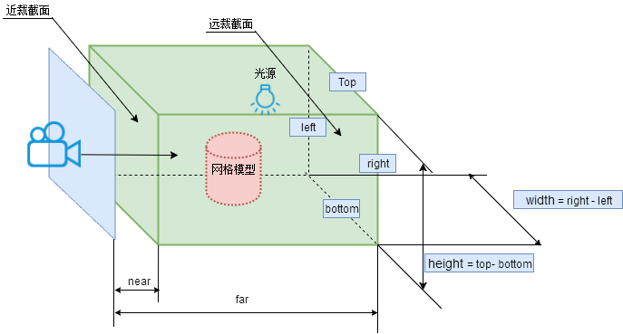
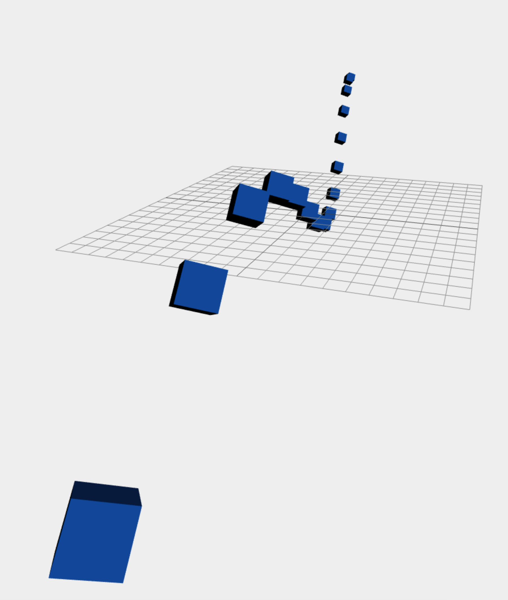
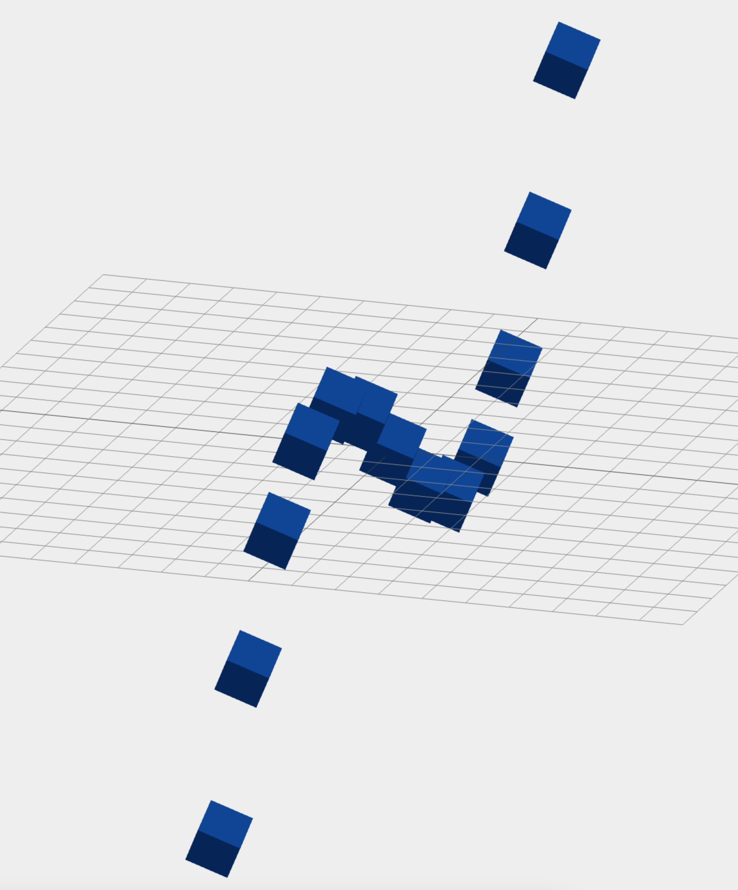

在 3D 场景中，相机扮演着“观察者”的角色，它决定了我们从哪里观察场景以及看到的画面效果。在 Three.js 中，相机是不可或缺的核心组成部分之一。

# Three.js 中的相机概念

在现实中，我们用眼睛观察世界，而在计算机生成的虚拟世界中，相机就是“眼睛”。它负责定义：

#### 1. 从哪个位置观察场景

在现实中，当你站在房间里，眼睛的位置决定了你看到房间的角度。比如：

如果你站在门口看房间，你看到的景象是正对着房间的。
如果你站在角落看房间，你看到的是一个侧面的视角。
在 Three.js 中，“相机”就是你的眼睛，它的位置由 camera.position 决定：

```javascript
camera.position.set(x, y, z);
```

- x 决定相机在左右方向上的位置。
- y 决定相机在上下方向上的位置。
- z 决定相机在前后方向上的位置。

#### 2. 观察的方向

假如你站在房间的门口，但背对着房间，你就看不到房间里的东西了。因此，相机不仅有“位置”，还需要“方向”，它定义了你在看向哪里。

在 Three.js 中，你可以用 camera.lookAt(x, y, z) 设置相机的观察方向。比如：

```javascript
camera.lookAt(0, 0, 0);
```

这表示相机会盯着 (0, 0, 0) 这个点，也就是场景的中心。

#### 3.可视范围（近剪裁面到远剪裁面之间的区域）

想象你戴了一副眼镜，眼镜的镜片决定了你能看到的范围。

- 近剪裁面：就像眼镜镜片的最近部分，它决定了你能看到的最近距离。离你太近的东西（比如紧贴镜片的东西）是看不到的。
- 远剪裁面：就像眼镜镜片的最远部分，它决定了你能看到的最远距离。离你太远的东西（比如天边的景物）也是看不到的。
  在 Three.js 中，你可以通过设置相机的 near 和 far 参数来定义这个范围：

```javascript
const camera = new THREE.PerspectiveCamera(75, aspect, 0.1, 1000);
```

- near = 0.1 表示相机能看到 0.1 米以外的东西。
- far = 1000 表示相机能看到 1000 米以内的东西。
  如果 near 太大，靠近相机的物体会“消失”。如果 far 太小，远处的物体也会看不到。

所以，相机简单理解就是：

- **位置**：相机站在哪里观察场景。
- **方向**：相机看向场景的哪个方向。
- **范围**：相机能看到的最近和最远的距离。

在 Three.js 中，相机是从 THREE.Camera 基类扩展出来的对象。通常，我们使用的相机有两种主要类型：

透视相机 (PerspectiveCamera)：模拟人眼的真实视觉效果。
正交相机 (OrthographicCamera)：适用于平行投影的效果，常用于 2D 场景或技术绘图。

# 透视相机 (PerspectiveCamera)

在 3D 图形学中，透视相机 (PerspectiveCamera) 模拟了人类的视觉效果。它的特点是具有“近大远小”的透视效果，比如你看一条延伸的公路时，公路在远处会逐渐变窄，这种效果就是透视。


在 Three.js 中，透视相机是通过 `THREE.PerspectiveCamera` 创建的。

#### 1. 定义与基本参数

```javascript
const camera = new THREE.PerspectiveCamera(fov, aspect, near, far);
```

- fov：视场角 (Field of View)，表示上下方向的视角范围，单位为度数。常用值在 45 到 75 度之间。视场角定义了相机的视野大小，视场角越大，能看到的范围越广，但物体会显得更小、更扁。
- aspect：宽高比 (aspect ratio)，通常设置为画布的宽度/高度。如果宽高比设置不正确，图像会被拉伸或压缩
- near：近剪裁面 (near clipping plane)，摄像机能看到的最近距离。
- far：远剪裁面 (far clipping plane)，摄像机能看到的最远距离。

注意：
near 和 far 的差值不要设置太大，否则可能会导致深度冲突 (对象边缘会闪烁)。

#### 2. 创建一个透视相机

下面是创建透视相机的完整代码示例：

```javascript
const fov = 75; // 视角
const aspect = window.innerWidth / window.innerHeight; // 宽高比
const near = 0.1; // 近剪裁面
const far = 1000; // 远剪裁面

const camera = new THREE.PerspectiveCamera(fov, aspect, near, far);
camera.position.set(0, 1, 5); // 将相机放置在 (0, 1, 5) 的位置
camera.lookAt(0, 0, 0); // 让相机朝向场景中心
```

# 正交相机 (OrthographicCamera)

正交相机是一种特殊的相机类型，与透视相机不同，它没有“近大远小”的透视效果。无论物体离相机远还是近，它们在画面中的大小始终保持一致。这种相机常用于 2D 场景、UI 绘制、技术制图或某些特定的 3D 场景。

与透视相机不同，正交相机的投影方式是 平行投影。它不会考虑物体与相机之间的距离关系。无论物体离相机多远，投影到屏幕上的物体大小始终保持一致。这意味着 没有视角收缩，从而导致远近物体在画面上看起来相同大小。

#### 1. 特性

- 固定大小：无论物体离相机多远，它投影到屏幕上的尺寸都不会发生变化。也就是说，物体的大小在屏幕上始终是相同的。
- 没有透视缩放：正交相机没有透视投影中的“远小近大”的效果。物体的相对大小只与它在三维空间中的实际尺寸相关，而与距离相机的远近无关。

#### 2. 更直观的理解

你可以把正交相机看作是一个“**俯视图**”，相机视野内的物体无论距离相机远近，都保持相同的显示比例。比如：

- 如果你从上方看一个物体，无论它离你多远，你看到的它的大小在屏幕上会是一样的——就像一个二维平面上的图形。



#### 3. 介绍

##### 1. 定义与基本参数

正交相机与透视相机不同，它不具有透视效果，所有对象看起来大小一致。使用方式如下：

```javascript
const camera = new THREE.OrthographicCamera(
  left,
  right,
  top,
  bottom,
  near,
  far
);
```

- left：画布左边界的位置。
- right：画布右边界的位置。
- top：画布上边界的位置。
- bottom：画布下边界的位置
- near：相机能看到的最近距离。
- far：相机能看到的最远距离。。
- near 和 far：近、远剪裁面，功能与透视相机类似。

##### 2. 适用场景

正交相机常用于：

1.  2D 游戏开发，因为它渲染出的画面没有透视变形，场景元素的比例始终保持一致，这非常适合游戏中平面元素的绘制和交互。它可以保证游戏角色、地图元素在不同位置显示时不会因透视缩小或拉伸。
2.  在工业设计、建筑可视化等领域，需要生成没有透视变形的等距视图。正交相机可以确保物体的边和角度在投影中保持不变，使得测量和绘图更精确。无透视缩放，物体的真实比例和相对位置不会因相机距离而改变。
3.  不需要透视效果的 UI 界面。 在 3D 场景中叠加 2D UI 元素时，正交相机非常适用。例如，在游戏、AR 或 VR 应用中，屏幕上的用户界面（如按钮、进度条）需要始终保持稳定的大小和位置，不随相机的移动或缩放而改变。

##### 3. 创建一个正交相机

假设我们有一个 800×600 的画布，可以这样设置正交相机：

```javascript
const aspect = 800 / 600;
const frustumSize = 5; // 可视范围大小
const camera = new THREE.OrthographicCamera(
-frustumSize _ aspect / 2, frustumSize _ aspect / 2, // left, right
frustumSize / 2, -frustumSize / 2, // top, bottom
0.1, 100 // near, far
);
camera.position.set(0, 0, 10); // 放置在远离场景的地方
camera.lookAt(0, 0, 0); // 朝向场景中心
```

# 正交相机与透视相机的区别

| 特性             | 正交相机 (OrthographicCamera)           | 透视相机 (PerspectiveCamera)       |
| ---------------- | --------------------------------------- | ---------------------------------- |
| **透视效果**     | 无近大远小效果                          | 有近大远小效果                     |
| **应用场景**     | 2D 渲染、技术制图、UI、等距渲染         | 游戏、建筑可视化、真实场景渲染     |
| **参数定义**     | 使用平面边界 (left, right, top, bottom) | 使用视场角 (fov) 和宽高比 (aspect) |
| **远近物体比例** | 远近物体大小相同                        | 远近物体大小随离变化               |

# 相机的控制

#### 1. 手动控制

通过键盘或鼠标事件动态改变相机位置，例如：

```javascript
document.addEventListener("keydown", (event) => {
  if (event.key === "ArrowUp") camera.position.z -= 0.1;
  if (event.key === "ArrowDown") camera.position.z += 0.1;
  if (event.key === "ArrowLeft") camera.position.x -= 0.1;
  if (event.key === "ArrowRight") camera.position.x += 0.1;
});
```

#### 2. 使用 OrbitControls

OrbitControls 是 Three.js 提供的常用相机控制工具，可以通过鼠标轻松实现旋转、缩放、平移等功能。

```javascript
import { OrbitControls } from "three/examples/jsm/controls/OrbitControls.js";

const controls = new OrbitControls(camera, renderer.domElement);
controls.enableDamping = true; // 开启惯性
```

# 案例

最后，我们用一个简单的例子来演示透视相机和正交相机的区别。
思路如下：

1. 创建一个场景，添加多个立方体，分布在不同的深度。
2. 创建透视相机和正交相机，分别观察场景。通过按键 1 和 2 切换相机。1 切换到透视相机，2 切换到正交相机。
3. 透视相机位置在 (10, 10, 30)，正交相机位置在 (10, 10, 30)。
4. 相机的观察位置都在 (0, 0, 0)。

看到下面的效果图，你就能感受到透视相机和正交相机的区别，透视相机有近大远小的透视效果，正交相机没有透视效果，物体大小保持一致。

#### 透视相机展示



#### 正交相机展示



```javascript
// 引入 Three.js 基础模块
import * as THREE from "three";

// 创建场景
const scene = new THREE.Scene();
scene.background = new THREE.Color(0xeeeeee);

// 添加光源
const light = new THREE.DirectionalLight(0xffffff, 1);
light.position.set(10, 10, 10);
scene.add(light);

// 创建多个立方体，分布在不同的深度
const geometry = new THREE.BoxGeometry(1, 1, 1);
const material = new THREE.MeshStandardMaterial({ color: 0x0077ff });

const cubes = [];
for (let i = -10; i <= 10; i++) {
  const cube = new THREE.Mesh(geometry, material);
  cube.position.set(i, Math.sin(i * 0.5) * 5, i * 5); // 加大纵深分布
  scene.add(cube);
  cubes.push(cube);
}

// 添加地面辅助线
const gridHelper = new THREE.GridHelper(20, 20);
scene.add(gridHelper);

// 创建渲染器
const renderer = new THREE.WebGLRenderer({ antialias: true });
renderer.setSize(window.innerWidth, window.innerHeight);
document.body.appendChild(renderer.domElement);

// 创建透视相机
const aspect = window.innerWidth / window.innerHeight;
const perspectiveCamera = new THREE.PerspectiveCamera(
  75, // 视角
  aspect, // 宽高比
  0.1, // 近裁剪面
  1000 // 远裁剪面
);
perspectiveCamera.position.set(10, 10, 30); // 拉远相机
perspectiveCamera.lookAt(0, 0, 0);

// 创建正交相机
const orthographicCamera = new THREE.OrthographicCamera(
  -10 * aspect, // 左
  10 * aspect, // 右
  10, // 上
  -10, // 下
  0.1, // 近裁剪面
  1000 // 远裁剪面
);
orthographicCamera.position.set(10, 10, 30); // 拉远相机
orthographicCamera.lookAt(0, 0, 0);

// 设置当前相机为透视相机
let currentCamera = perspectiveCamera;

// 切换相机事件
document.addEventListener("keydown", (event) => {
  if (event.key === "1") {
    currentCamera = perspectiveCamera;
    console.log("切换到透视投影相机");
  } else if (event.key === "2") {
    currentCamera = orthographicCamera;
    console.log("切换到正交投影相机");
  }
});

// 动画循环
function animate() {
  requestAnimationFrame(animate);

  // 让每个立方体旋转
  cubes.forEach((cube) => {
    cube.rotation.x += 0.01;
    cube.rotation.y += 0.01;
  });

  renderer.render(scene, currentCamera);
}
animate();
```
