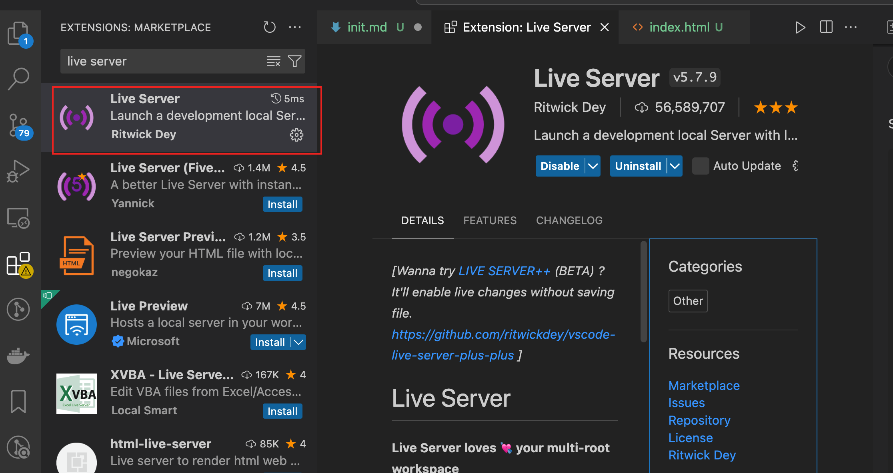
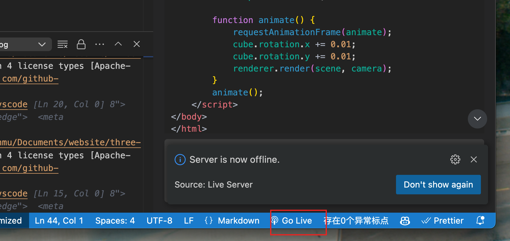
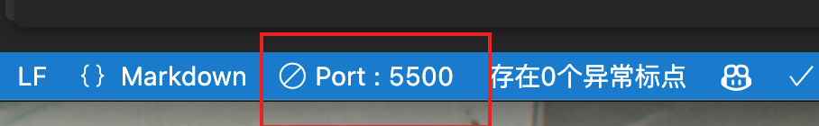
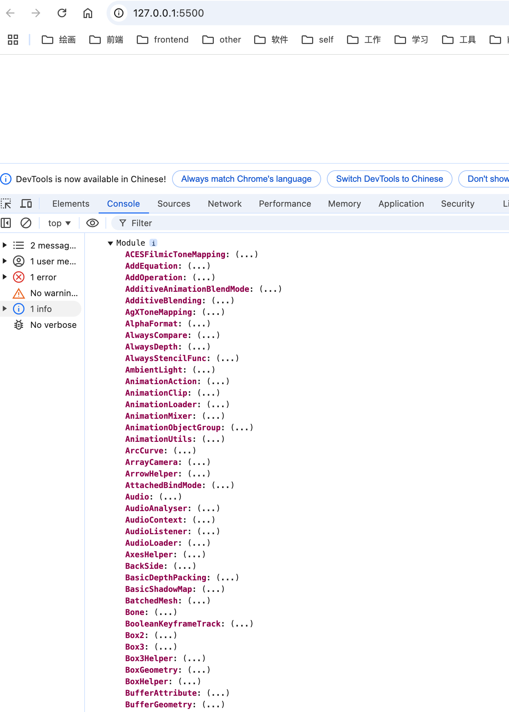
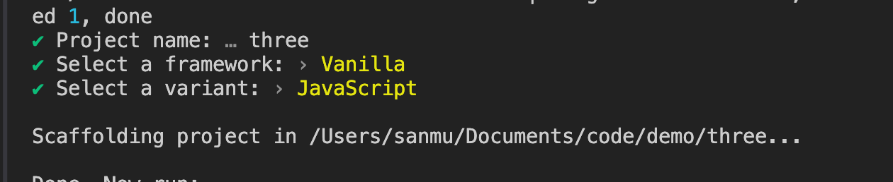
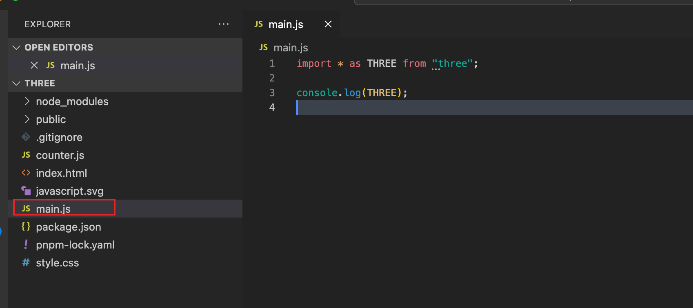
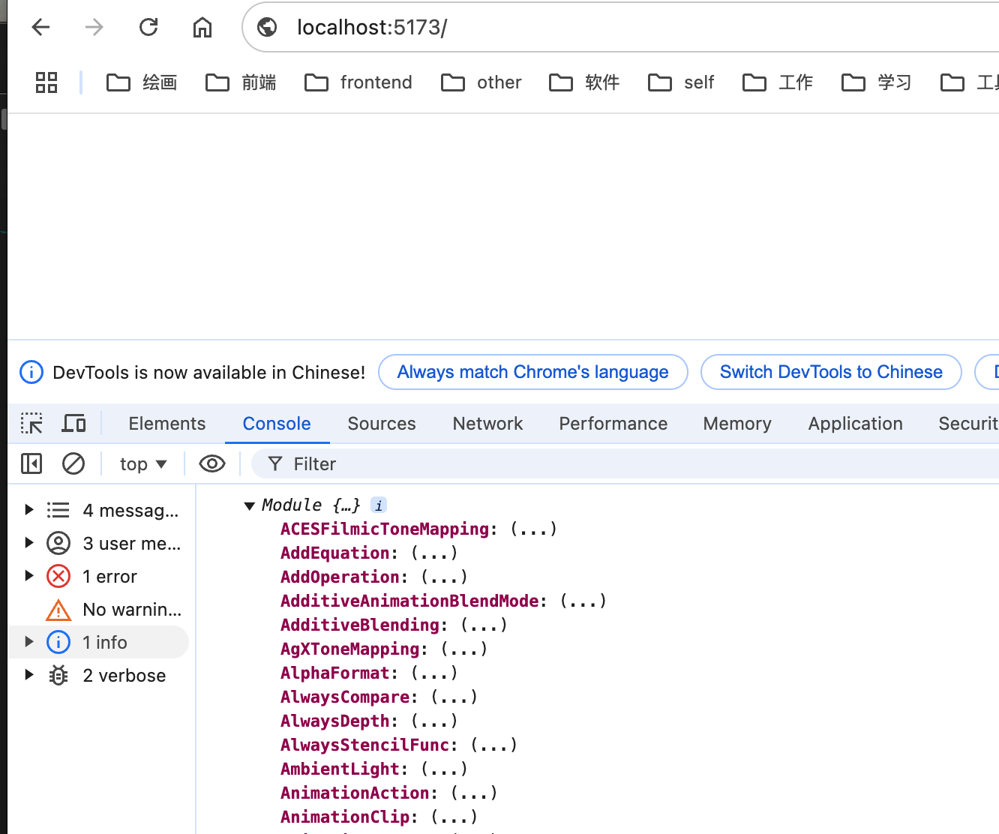

# 搭建 threejs 的环境

今天我们来介绍下，怎么准备 threejs 的环境.

## 通过 html 引入

创建一个 index.html 文件。

我们可以通过引入 threejs 的 cdn 来引入 threejs 的库，在引入的时候我们使用 importmap 来引入，这样我们就可以使用 es6 的模块化来引入 threejs 了。

```html
<!DOCTYPE html>
<html lang="en">
  <body>
    <script type="importmap">
      {
        "imports": {
          "three": "https://cdn.jsdelivr.net/npm/three@0.170.0/build/three.module.min.js"
       script   }
    </script>
    <script type="module">
      import * as THREE from "three";
      console.log(THREE);
    </script>
  </body>
</html>
```

注意上 script 词，分别是第 6 行的 `importmap` 和第 10 行的 `module`，这两个关键词是 es6 的模块化的关键词，`importmap` 是用来引入第三方库的，`module` 是用来引入 es6 模块的。

这里还有一个注意的地方，我们运行这个文件，不能直接双击打开这个 index.html,因为浏览器会报错，我们需要通过一个服务器来运行这个文件，我们可以通过安装一个 live-server 来运行这个文件。

用 vscode 的话可以直接安装一个插件 live server，然后右键点击 index.html 选择 open with live server 就可以运行了。



安装好了这个插件之后，我们可以直接右键点击 index.html 选择 open with live server 就可以运行了。
或者通过右下角的 Go Live 按钮来运行。

点击运行成功后，可以看到服务启动的端口号，然后我们可以在浏览器中输入这个端口号来访问我们的页面。

在浏览器中访问 http://localhost:5500 就可以看到我们的页面了。

同时看到控制台中输出了 THREE 对象，说明我们引入成功了。

上面我们用了 importmap 来引入 threejs，我们也可以不使用它，直接通过 script 标签引入 threejs。

```js
import * as THREE from "https://cdn.jsdelivr.net/npm/three@0.170.0/build/three.module.min.js";
```

毫无疑问，这种的代码的可读性没有上面优雅。

对于直接请求在线的资源，实际上我们也可以将这个文件下载下来，然后使用相对路径进行引入。

以上，就是通过 html 引入 threejs 的方式。

# 搭建 vite 环境

vite 是一个基于 esmodules 的开发服务器，它可以让我们在开发的时候使用 es6 的模块化来开发，同时它还支持热更新。
使用它很方便搭建一个纯 js，或者 vue，react 的项目。
官方文档：https://vitejs.cn/vite3-cn/guide/

## 安装 vite

```
npm create vite
```

对于原生 js 的项目，我们可以选择 vanilla。

接着我们安装 threejs。

```
npm install three
```

有时候，我们会遇到网络问题，依赖一直下载不下来，可以通过国内源来下载。

```
npm install three --registry=https://registry.npmmirror.com
```

然后我们可以在 src/main.js 中引入 threejs。


```js
import * as THREE from "three";
console.log(THREE);
```

接着我们运行项目。

```
npm run dev
```

同样，我们在浏览器中访问 http://localhost:5173 就可以看到控制台输出了 THREE 对象


如果开发一个正式一点的项目，还是建议使用 vite 来搭建项目。只是想运行一个简单的案例，熟悉下某个 API，那么可以直接通过 html 来引入 threejs。
