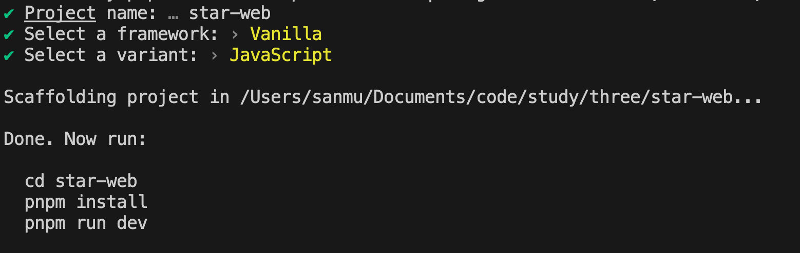
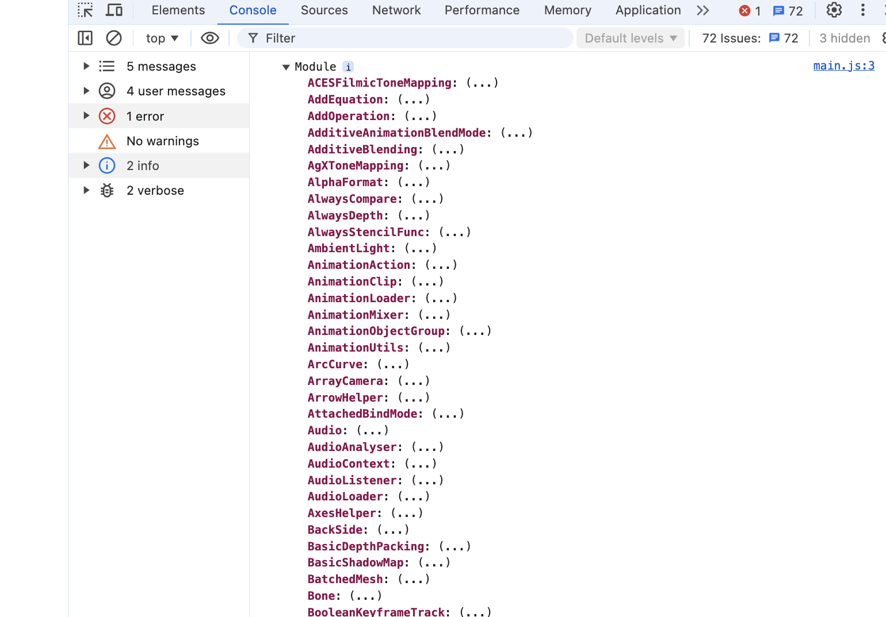
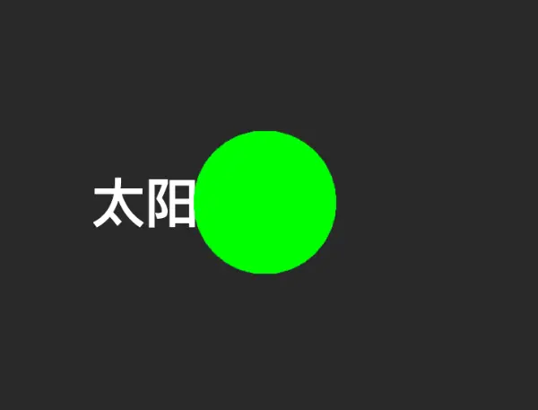
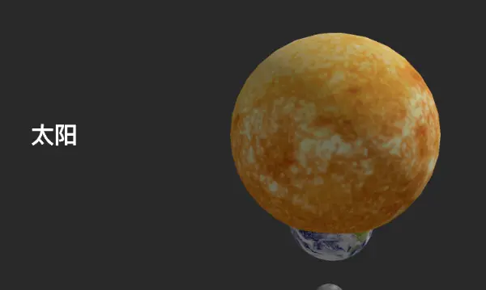
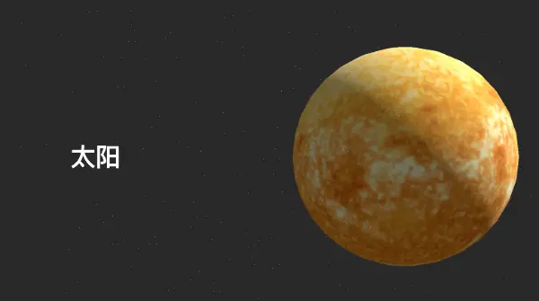

#

## 介绍

今天，使用 threejs 实现一个简单的网站，是结合 threejs 的一个项目。

先看一下效果


## 项目初始化

使用 vite 进行项目初始化，可以用 npm 进行创建项目，也可以使用 pnpm 进行创建项目，这里使用 pnpm 进行创建项目。

```
pnpm create vite
```

执行命令后，下面的选项根据这张图进行勾选。



### 安装项目依赖

这里注意要用下面我的案例的版本，随着时间 threejs 会进行更新，到时候可能很多 api 会有变化，为了降低学习成本，建议使用我这个版本。这样文章下面的代码肯定是能运行的。

```
pnpm install three@0.169.0
```

### 启动项目

```
pnpm dev
```

## 开发

打开 main.js, 将里面的代码都删了，然后写入下面的代码。

```js
import * as THREE from 'three';

console.log(THREE);
```

打开 f12，查看控制台 console，如果输出了 THREE 对象，说明安装成功。


#### 搭建静态页面

打开项目的 html 文件，然后写入我们的三个区块

```html
<canvas id="canvas"></canvas>
<section class="section">
  <h2>太阳</h2>
</section>
<section class="section">
  <h2>地球</h2>
</section>
<section class="section">
  <h2>月球</h2>
</section>
```

然后在 css 文件中写入样式，我们设置每块都占满屏幕。为后续的布局做准备。

```css
#canvas {
  position: fixed;
  top: 0;
  left: 0;
}

.box {
  display: flex;
  align-items: center;
  height: 100vh;
  font-size: 48px;
  padding-left: 20%;
}

/*  奇数在右边 */
.box:nth-child(odd) {
  justify-content: flex-end;
  padding-right: 10%;
}
```

最后在 main.js 中引入 css 文件

```js
import './style.css';
```


#### 创建场景

```js
import * as THREE from 'three';
import './style.css';

const canvas = document.getElementById('canvas');
// 创建场景
const scene = new THREE.Scene();

// 创建相机
const camera = new THREE.PerspectiveCamera(
  35,
  window.innerWidth / window.innerHeight,
  0.1,
  100
);
camera.position.set(0, 0, 10); // 设置相机位置
scene.add(camera); // 将相机添加到场景中

// 创建渲染器
const renderder = new THREE.WebGLRenderer({
  canvas,
});
renderder.setClearAlpha(0); // 设置透明背景
renderder.setSize(window.innerWidth, window.innerHeight); // 设置渲染器的大小

// 创建立方体
const geometry = new THREE.BoxGeometry(1, 1, 1);
const material = new THREE.MeshBasicMaterial({ color: 0x00ff00 });
const cube = new THREE.Mesh(geometry, material);
cube.position.set(0, 0, 0); // 设置立方体位置
scene.add(cube);

// 渲染
renderder.render(scene, camera);
```


现在可以在页面看到一个绿色的立方体，代表你已经成功创建了一个 three 的场景。

#### 创建星球

1. 通过 `THREE.SphereGeometry` 创建一个球体
2. 通过 `THREE.MeshBasicMaterial` 创建一个材质
3. 通过 `THREE.TextureLoader` 创建引入星球的贴图
4. 通过 `THREE.Mesh` 创建一个星球

```js
// 太阳
const distance = 1;
const sun = new THREE.Mesh(
  new THREE.SphereGeometry(1.2),
  new THREE.MeshStandardMaterial({
    map: textLoader.load('img/sun_bg.jpg'),
  })
);
sun.position.set(1.5, distance * 0, 0); // 设置立方体位置
scene.add(sun);

// 地球
const earth = new THREE.Mesh(
  new THREE.SphereGeometry(0.5),
  new THREE.MeshStandardMaterial({
    map: textLoader.load('img/earth_bg.jpg'),
  })
);
earth.position.set(1.5, -distance * 1, 0); // 设置立方体位置
scene.add(earth);

// 月球
const moon = new THREE.Mesh(
  new THREE.SphereGeometry(0.2),
  new THREE.MeshStandardMaterial({
    map: textLoader.load('img/moon_bg.jpg'),
  })
);
moon.position.set(1.5, -distance * 2, 0); // 设置立方体位置
scene.add(moon);

const animate = () => {
  renderder.render(scene, camera);

  requestAnimationFrame(animate);
};
animate();
```

在这里，我们使用了 distance 变量来控制每个星球之间的距离，然后通过 position 来设置每个星球的位置。

还有一个主意就是我们最后一定要，增加一个 animate 函数，这个函数会在每一帧都执行，因为我们的贴图是异步的，导致可能在贴图加载完成之前，就已经渲染了，导致看不到贴图，所以我们需要重新在渲染一次。

至此，你在页面右侧应该可以看见三个球体。


#### 滚动

到此为止，我们已经在页面创建了星球了，但是现在所有的球体都在太阳这个区块里面。
现在，我们需要让每个星球都在自己的区块里面，这样我们就可以看到每个星球了。所以，我们要做的事

1. 计算每个区块的位置，将每个星球的 position 的 y 坐标放到对应的区块中
2. 增加滚动事件，当我们滚动鼠标的时候，通过 `camera.position.y` 来控制相机的位置，当我们的相机向下移动，从视觉上看，就是星球在上升。threejs 的 y 坐标的数值和浏览器滚动的 scrolly 的数值是不相等的，所以我们需要进行换算。
   2.1 我们先设置 distance 的值为 4，然后将每个球体的间距设置为 distance，然后通过 distance _ i 来设置每个星球的位置。
   2.2 当我们进行滚动条滚动后，我们通过 -scrollY / window.innerHeight _ distance 将滚动条的数值转换成摄像机的 y 坐标。

```js
const distance = 4;
// 太阳
const sun = new THREE.Mesh(
  new THREE.SphereGeometry(1.2),
  new THREE.MeshStandardMaterial({
    map: textLoader.load('img/sun_bg.jpg'),
  })
);
sun.position.set(1.5, distance * 0, 0); // 设置立方体位置
scene.add(sun);

// 地球
const earth = new THREE.Mesh(
  new THREE.SphereGeometry(1.2),
  new THREE.MeshStandardMaterial({
    map: textLoader.load('img/earth_bg.jpg'),
  })
);
earth.position.set(-1.5, -distance * 1, 0); // 设置立方体位置
scene.add(earth);

// 月球
const moon = new THREE.Mesh(
  new THREE.SphereGeometry(1.2),
  new THREE.MeshStandardMaterial({
    map: textLoader.load('img/moon_bg.jpg'),
  })
);

const animate = () => {
  renderder.render(scene, camera);
  camera.position.y = (-scrollY / window.innerHeight) * distance;
  renderder.render(scene, camera);
  requestAnimationFrame(animate);
};
```

至此，我们可以让星球跟着浏览器进行滚动了


#### 动画

现在的星球太死板了，我们需要让他们动起来，我们可以通过旋转来让他们动起来。在 animate 函数下，增加

```js
const animate = () => {
  camera.position.y = (-scrollY / window.innerHeight) * distance;

  // 星球旋转
  sun.rotation.y += 0.01;
  earth.rotation.y += 0.01;
  moon.rotation.y += 0.01;

  renderder.render(scene, camera);

  requestAnimationFrame(animate);
};
```


然后，我们在进行优化，当鼠标在屏幕上移动的时候，我们让星球也进行一点抖动

1. 获取鼠标的位置

```js
let mouse = {
  x: 0,
};
window.addEventListener('mousemove', (event) => {
  mouse = {
    x: event.clientX,
  };
});
```

2. 计算鼠标的位置和星球的位置的差值
3. 让星球的位置加上差值, 因为差值特别大，所以我们需要乘以一个系数，这里我们乘以 0.5，然后我们在乘以 deltaTime（渲染的这帧和上一帧的时间差），这样我们就可以让星球的位置平滑的变化。

```js
const clock = new THREE.Clock();
let oldElapsedTime = 0;
const animate = () => {
  const elapsedTime = clock.getElapsedTime();
  const deltaTime = elapsedTime - oldElapsedTime;

  oldElapsedTime = elapsedTime;
  renderder.render(scene, camera);

  camera.position.y = (-scrollY / window.innerHeight) * distance;

  const cursorX = mouse.x / window.innerWidth - 0.5;

  const parallaxX = cursorX * 0.5;

  camera.position.x += (parallaxX - camera.position.x) * 4 * deltaTime;

  // 星球旋转
  sun.rotation.y += 0.01;
  earth.rotation.y += 0.01;
  moon.rotation.y += 0.01;

  renderder.render(scene, camera);

  requestAnimationFrame(animate);
};
```

这样当我们鼠标在屏幕上移动的时候，星球就会进行抖动了。


##### 增加粒子

现在画面太空，我们给背景增加一些粒子

```
const particlesCount = 5000;
const posArray = new Float32Array(particlesCount * 3);

for (let i = 0; i < particlesCount; i++) {
  posArray[i * 3] = (Math.random() - 0.5) * 5;
  posArray[i * 3 + 1] = distance * 0.5 - Math.random() * distance * stars.length
  posArray[i * 3 + 2] = (Math.random() - 0.5) * 5;
}
const particlesGeometry = new THREE.BufferGeometry();

particlesGeometry.setAttribute('position', new THREE.BufferAttribute(posArray, 3));
const particlesMaterial = new THREE.PointsMaterial({
  size: 0.005,
  color: 0xffffff,
  setAttenuation: true // 设置衰减
});

const particles = new THREE.Points(particlesGeometry, particlesMaterial);
scene.add(particles);
```



到此我们，整个页面算是开发完了，但是现在页面感觉还是太空。所以我们可以给标题下面在增加一些介绍。

我们先改 html, 增加一个 text 的 div，增加描述文字

```
<!-- html -->
 <div class="box">
  <div>
    <h2>太阳</h2>
    <div class="text">
      太阳是太阳系的中心，也是地球和其他行星的主要能量来源。作为一颗黄矮星，它通过核聚变反应，将氢转化为氦并释放出巨大的能量。太阳的光和热使地球能够维持生命，并影响整个太阳系的天气和气候。它占据了太阳系99.86%的总质量，其巨大的引力将所有行星、卫星、小行星和彗星维系在各自的轨道上。太阳的直径约为140万公里，距地球约1.5亿公里，光从太阳到达地球大约需要8分钟20秒。
    </div>
  </div>
</div>

<!-- css -->
.text {
  font-size: 20px;
  width: 600px;
}

```

最后，大家可以按照前面的星球然后将其他星球的内容补上，最后的效果如下

