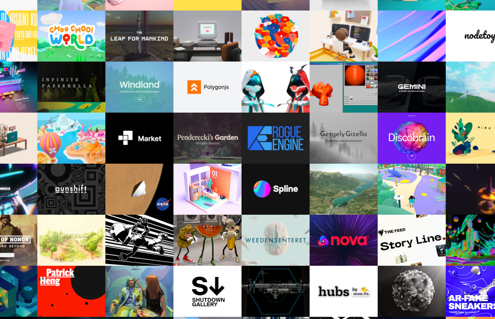
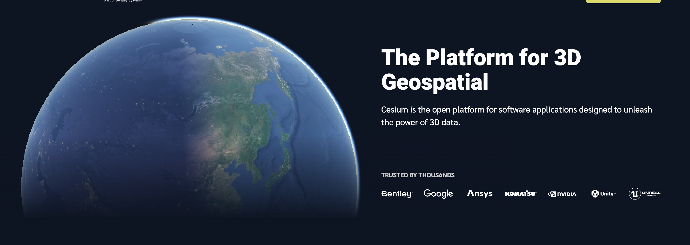

随着技术的进步，三维可视化技术已经渗透到各行各业，不仅仅局限于游戏和娱乐领域，更多的是应用到数字孪生、智慧城市、建筑可视化等复杂场景中。Web3D 渲染引擎作为实现这一切的核心技术，已经发展出了多种开源和商业化的方案。今天，我们将介绍 Web3D 渲染引擎，它们各自具有独特的功能和应用场景，能够为开发者提供强大的支持。

# 1. Three.js

作为一款基于 WebGL 的开源 JavaScript 库，Three.js 是 Web 三维图形开发中的佼佼者。它简化了 WebGL 的复杂性，使开发者能够更加轻松地构建和渲染 3D 场景。通过 Three.js，用户可以在浏览器中创建从简单几何体到复杂 3D 模型、动画的各种内容。

**Three.js 的核心特点**：

- **简易的 API**：Three.js 提供了简洁且易用的 API，使得即使是前端新手也能轻松入门，快速构建 3D 应用。
- **多种几何形态支持**：支持各种常见的 3D 几何体格式，同时也可以创建自定义模型。
- **灯光与阴影**：通过点光源、平行光源等，结合精细的阴影处理，增强场景的真实感。
- **动态渲染与物理引擎**：通过内置的动画系统和物理引擎（如 Cannon.js），用户可以创建动态的交互体验。

**适用场景**：

- **数字孪生与智慧城市**：通过三维可视化技术展示城市、交通、建筑等信息。
- **游戏与动画**：在浏览器中创建基于 Web 的 3D 游戏或动画效果。
- **数据可视化**：通过交互式 3D 图表展现复杂数据。

**教程与学习资源**：

- [Three.js 官网文档](https://threejs.org/docs/)
- [中文社区](https://webgl3d.cn/)

# 2. Babylon.js：为 Web 开发创造完美的 3D 体验

Babylon.js 是一款专为 Web 浏览器设计的开源 3D 引擎，支持各种现代浏览器和设备，能够帮助开发者创建高质量的交互式 3D 应用。

**Babylon.js 的核心特点**：

- **WebGL 支持**：支持 WebGL 1.0、2.0 和 WebGPU，能够在各种平台上流畅渲染 3D 内容。
- **强大的物理引擎支持**：内置多个物理引擎（如 oimo.js、ammo.js），为开发者提供真实的物理效果。
- **跨平台支持**：支持 iOS、Android、桌面设备以及 VR/AR 设备，能够在多种平台上运行。
- **粒子系统与音效引擎**：支持粒子系统和 Web Audio，可以让应用更加生动和有沉浸感。

**适用场景**：

- **游戏开发与虚拟现实**：开发 Web 端的 3D 游戏或沉浸式 VR/AR 应用。
- **建筑与产品展示**：通过高质量的渲染效果展示建筑、产品等内容。
- **数据可视化**：创建高度交互的三维数据可视化图表。

**教程与学习资源**：

- [中文社区](https://www.cnbabylon.com/)

# 3. Cesium：地理信息与三维地图的极致演绎

Cesium 是一款专注于地理空间数据可视化的开源 JavaScript 框架。它能够渲染全球范围内的高精度三维地图，并且支持与各种地理数据源进行互动，广泛应用于数字孪生、航空航天等领域。

**Cesium 的核心特点**：

- **跨平台支持**：支持 2D、2.5D 和 3D 模式，无论用户使用何种设备，都能获得流畅的体验。
- **时间动态数据展示**：利用时间轴功能，动态展示带有时间属性的数据，例如卫星轨迹、气象数据等。
- **大规模地理数据渲染**：能够加载各种地理数据格式（如 GeoJSON、KML、3D Tiles），支持大规模的 3D 数据渲染。
- **高精度渲染**：通过 WebGL 的硬件加速，Cesium 实现了高效的地理空间数据可视化。

**适用场景**：

- **智慧城市与环境监测**：通过 Cesium 展示城市地理信息，进行环境与资源的实时监控。
- **地理信息系统（GIS）**：应用于地理数据展示、航空航天等领域。

**教程与学习资源**：

- [Cesium 官方网站](https://cesium.com/)

# 4. Mapbox GL：为地图应用带来革命性变化

Mapbox GL 是一个现代化的地图平台，能够帮助开发者快速构建定制化的地图应用。其最大特点是支持矢量瓦片渲染，提供了非常高效的地图渲染和可定制性。

**Mapbox GL 的核心特点**：

- **矢量瓦片渲染**：通过矢量瓦片技术，地图数据的加载和渲染速度大大提高，尤其在需要动态更新和缩放时表现尤为优秀。
- **强大的样式定制能力**：开发者可以自定义地图的颜色、符号图标等，打造个性化的地图样式。
- **数据驱动的样式**：允许开发者根据数据属性动态修改地图元素，进行实时更新。
- **WebGL 渲染**：利用 WebGL 技术，Mapbox GL 能够在现代浏览器中平滑渲染高质量地图。

**适用场景**：

- **智能交通与导航**：在智慧城市的背景下，开发实时交通监控与路线规划应用。
- **地理数据分析**：利用动态地图展示大规模地理数据分析结果。

**教程与学习资源**：

- [中文社区资源](https://docs.mapbox.com/)
